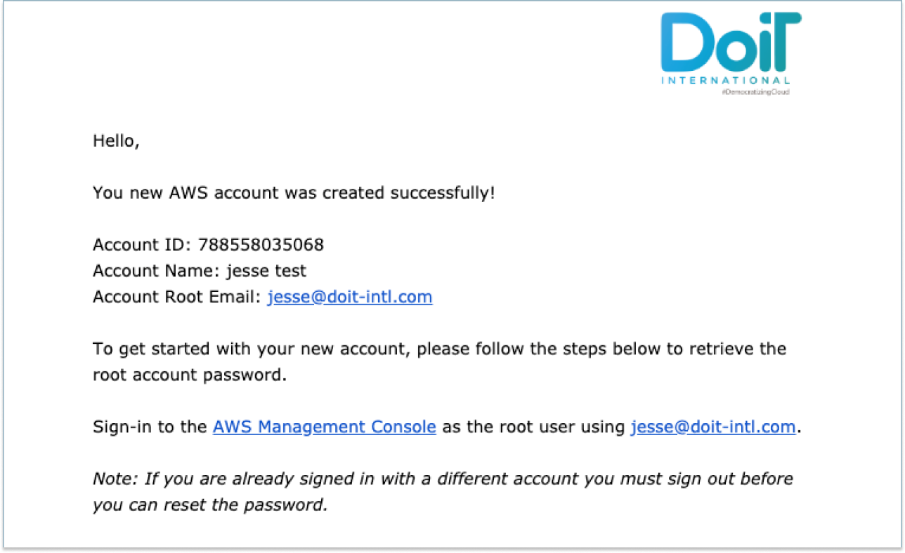

# Create An AWS Account

As a customer, you can create a new AWS account directly from the Cloud Management Platform.


Please note you must be assigned access to the specific Billing Profile under which the domain is managed in order to create a new account.



You will see an **OrganizationAccountAccessRole** in the new AWS account. This role is created by AWS and links back to the parent account. When creating the account we will use this role to [create the CloudHealth IAM Role](https://help.doit-intl.com/amazon-web-services/set-up-cloudhealth). The CMP or DoiT International will not use this role afterwards and you will have to **manually remove this role from your account**


Within the CMP, select _Billing_ from the top navigation bar and then select _Assets_. The CMP will take you to the _Assets_ page.

From the _Assets_ page, select _Amazon Web Services_ from the left-hand menu:

From the Amazon Web Services assets page, select the arrow next to the _Invite Account_ button, then select _Create Account_ from the drop-down menu that appears. Finally, select the button a second time (which should now read _Create Account_).

The CMP will open a modal dialog:

Then:

1. Choose the billing profile for the account
2. Chose a name for the account
3. Set the _root email_

When you are done, select _Create_.

The CMP will display a confirmation message:

The CMP will send you an email with further instructions. For example:

The following video walks you through the whole process:



Please [get in touch with our support team](https://support.doit-intl.com) if you require further assistance.
