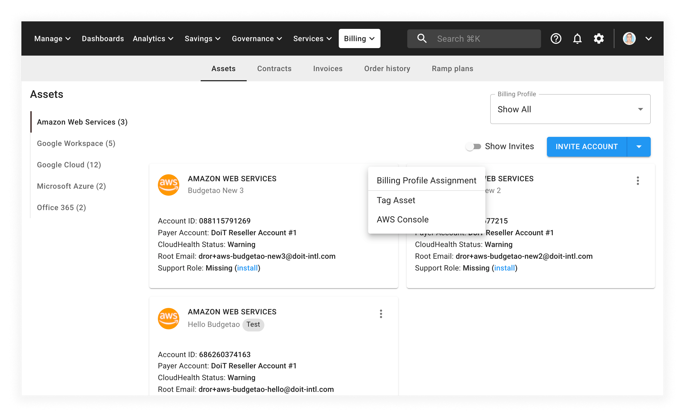
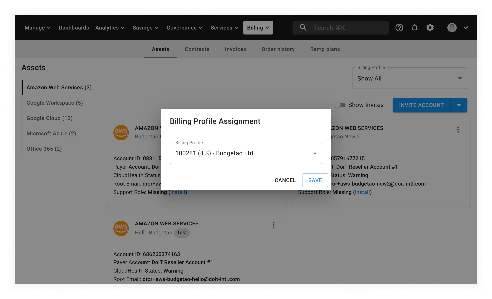

# Assign Assets to Billing Profiles

You can assign assets to [Billing Profiles](../invoices-and-payments/setting-up-a-new-billing-profile.md) for invoicing purposes. Since every Billing Profile receives its own monthly invoice, how you assign assets will affect how each entity is billed.



Required Role: **Admin**



1. Navigate to the _Assets_ page via the _Billing_ menu from the top navigation bar
2. From the _Assets_ page, select the asset type from the left-hand menu (_Amazon Web Services_, _Google Workspace_, and so on)
3. After finding the asset you want to tag, select the three dots icon in the top right-hand corner of the asset card
4. Select _Billing Profile Assignment_ from the drop-down menu:

   

   The CMP will open a new modal dialog:

   

5. Select the desired billing profile from the drop-down menu
6. Select _Save_

The CMP will assign the asset to the selected billing profile.
