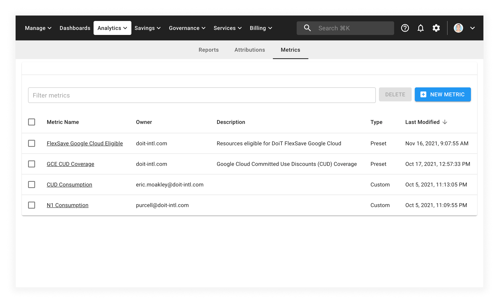
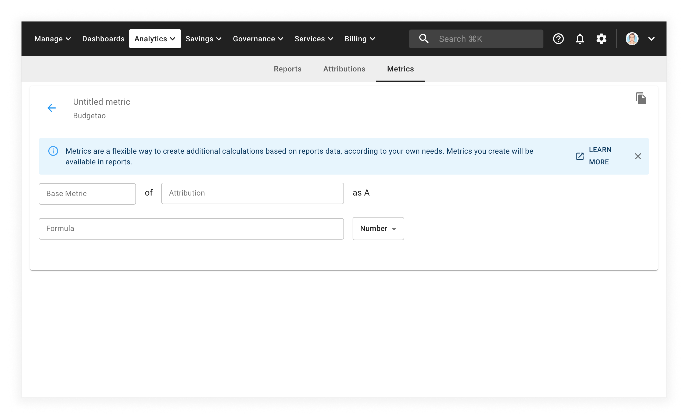

# Custom Metrics

## Overview

Custom metrics allows customers to calculate metrics based on existing [attributions](attributing-cloud-spend.md) within the CMP. Often when reporting on cost and usage for cloud environments the dimensions and metrics in your bill are not sufficient to understand key information. By creating formulas with portions of the bill key indicators of performance can be surfaced more cleanly.

For example:

* **Percentage of GCP CUD utilized**

  CUD (committed use discount) Usage / CUD (committed use discount) Commitment

* **Amortized Instance Reservation Consumption**

  Monthly Ec2 Instance type usage / (1 yr Reserved Instance type commitment / 12)

* **Percentage Shared Infrastructure Cost**

  Shared Infrastructure costs / Total Infrastructure Cost

Custom metrics can be particularly useful when tracking consumption of shared services. Determine what percentage of shared infrastructure is being used by a single app. Determine distribution of compute types across a set of accounts or projects.

## Structure of a Metric

Custom metrics are created by creating formula's with Attributions. Each Attribution must have a base metric selected for it. This can either be: Cost, Usage, or Savings.



For more information, see our [Metric selection documentation](editing-your-cloud-report.md#metrics).



For instance, if you want to create a metric to track the percentage consumption of a compute commitment, you will require two attributions:

* Compute Usage
* Compute Consumption

You must create these attributions before you creating a custom metric.

## Create a Metric

Select _Analytics_ from the top menu bar, then select _Metrics_ to access your custom metrics:

To create a new metric, select the _New Metric_ button to access the _New Metric_ screen:

From here:

1. Name the new custom metric by selecting the _Untitled metric_ text
2. Configure the _Base Metric_ and _Attributions_ by selecting the input and choosing values from the drop-down menus

As you configure each metric, a new row (named _A_, _B_, _C_, and so on) will
be added to the form so that you can continue continue to add more
attributions.

Create a formula to generate the metric desired (see below).

### Formulas

Formulas support standard **Order of Operations**

Custom metric formulas support the following operators:

| Operator | Description              |
| -------- | ------------------------ |
| +        | Addition                 |
| -        | Subtraction              |
| \*       | Multiplication           |
| /        | Division                 |
| ()       | Parentheses for grouping |


When a valid formula is created it will be automatically saved.


A formula is considered invalid if it is:

1. Empty
2. Invalid Variable Definition
   1. Attribution and/or base metric provide no data
   2. Variable is not complete (no metric selected, no attribution selected)
3. Invalid Formula
   1. Yields an error
   2. Divide by zero
   3. Incorrect formatting

When a valid formula is complete, a preview of the metric will be generated.

## Including Customer Metrics in Cloud Analytics Reports

To include a metric in a report, [create a new report](create-cloud-report/).

In the report configuration panel on the left-hand side, select your metric from the _Custom Metrics_ section at the bottom of the drop-down menu.

Once selected you will be prompted to confirm your choice

After confirming your choice, you can build your report as usual with the addition of your custom attributions.
