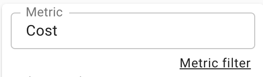

# Understanding Metric Filters

Metric Filters are a feature that allow you to filter the data composing your report at query time. Often when performing analysis it is helpful to hide values below or above certain thresholds in order to add additional focus and remove outliers.

## Add a Metric Filter

You can add a metric filter by selecting the link below the Metric dropdown or via the filter chip:

Selecting this option will allow you to configure your filter based on a set a criterion you select

Select the metric you would like to filter, the operator, and the value.


You can filter on a Metric that is not visible! For instance you can chart **Usage**, but filter any interval with a **Cost $lt; $50**


We support a range of operators:

When applied a filter chip will appear in the metric bar:

This chip will be blue when applied to the currently shown metric, and white while filtering a metric not currently shown in the report:

