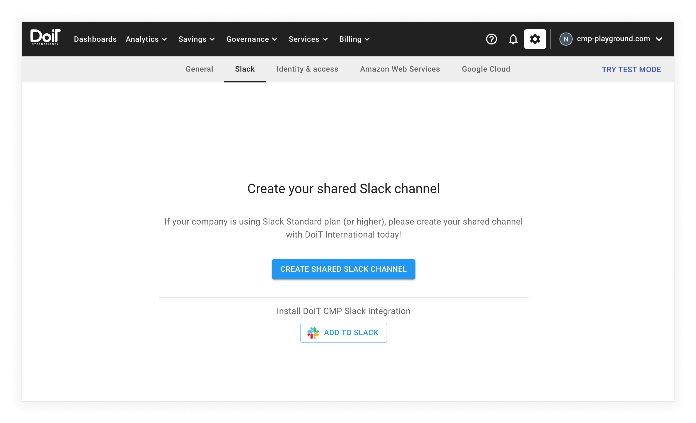
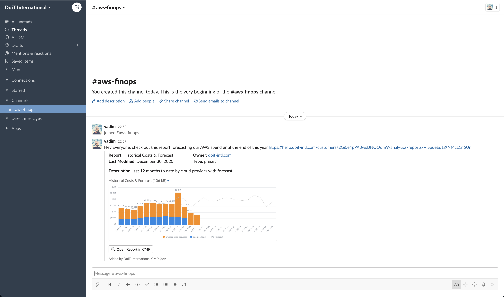

# Slack Application

The DoiT International Slack application can enhance your Slack experience by automatically unfurling links to the CMP and providing metadata and rich previews for [Cloud Analytics Reports](../cloud-analytics/create-cloud-report/README.md) and [budgets](../cloud-analytics/manage-budgets.md).

This application makes it easy for anyone in your Slack workspace to glean insights from the links you share without opening the CMP itself.



You can also use a [shared Slack channel](../services/consulting-support/shared-slack-channel.md) for instant notifications and quick responses from our engineering and support staff. If more investigation or work is needed, we will prompt you to [create a support request](../services/consulting-support/README.md) so that we can switch to an asynchronous workflow

_NOTE: The shared Slack channel and the DoiT Slack application (see below) are two different components of the CMP, and they can be enabled or disabled independently._



## Install the application



Only Slack workspace admins can install Slack applications. If you aren't an admin for your Slack workspace, forward this article to an admin or guide them through the process.



First, ensure you're logged in to both the CMP and Slack before installing the application.

From within the CMP, select the gear icon from the top navigation bar, then choose _Slack_ (under _Account settings_) from the drop-down menu. After choosing the _Slack_ menu item, the CMP will bring you to the _Slack_ settings page:

From here, select the _ADD TO SLACK_ button (bottom of the screen) and follow the instructions.

## Using the application

After completing the installation process, any CMP report or budget links you send in Slack will unfurl with metadata and, if applicable, a chart preview.

For example:

## Permissions

After one member of your Slack workspace has set up the DoiT Slack application for their account, all other members will see a prompt the next time they paste a CMP link.

The prompt will ask them to connect their CMP account to Slack. Slack will guide them through the authentication flow you see above if they choose to do so.

Once they have successfully connected their CMP account to Slack, any CMP links they paste in Slack will unfurl, providing they have access to the resource (see below).

Crucially, we ensure that users can only unfurl links to CMP resources when they have the necessary access permissions by performing Slack authentication at the user level.

## Privacy

The DoiT Slack application adheres to DoiT International's overall [privacy policy](https://www.doit-intl.com/privacy).
