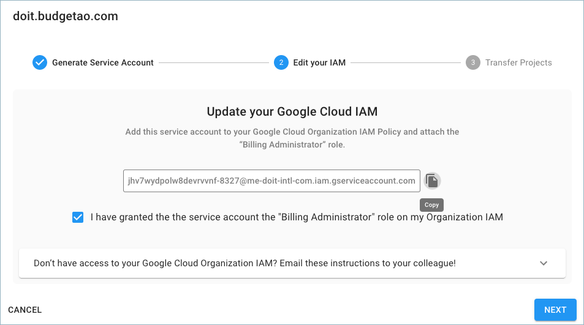
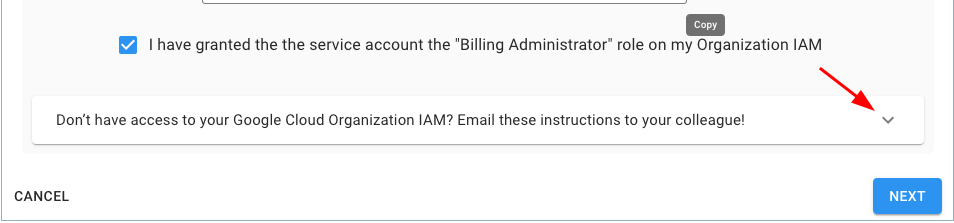
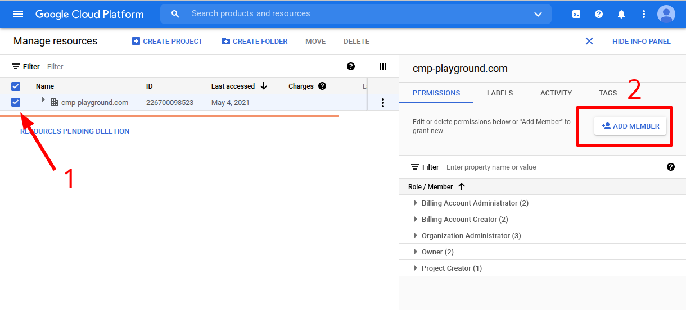
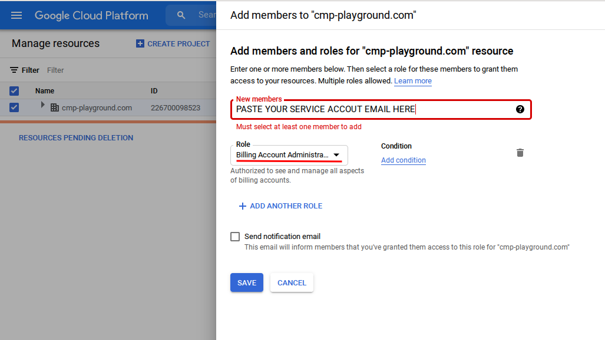
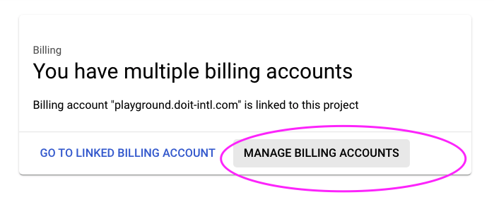
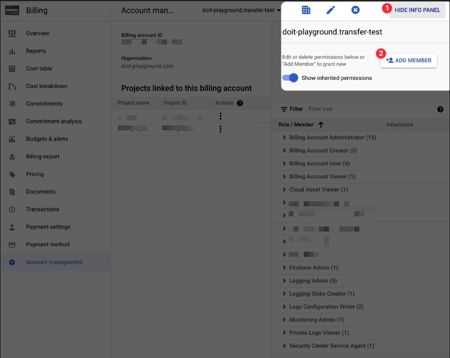
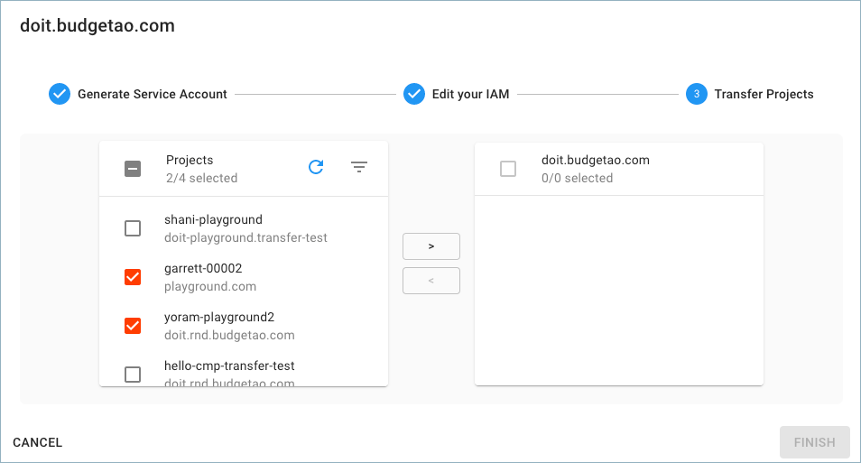
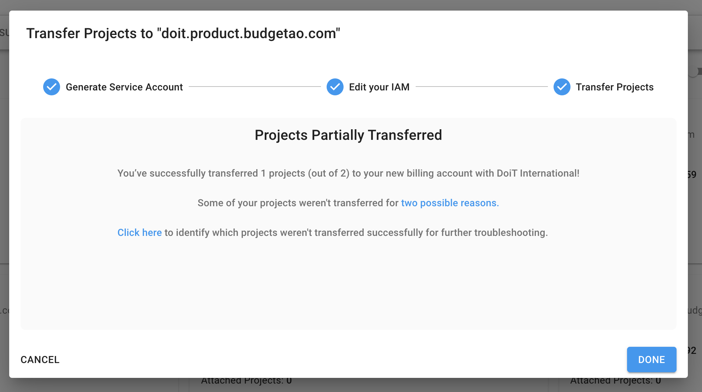
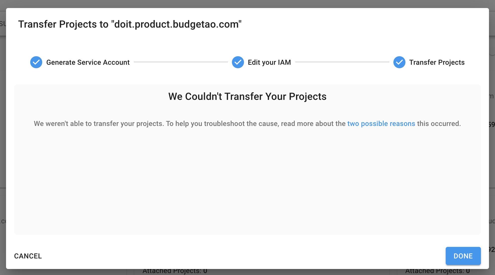

# Bulk Transfer using Wizard

This guide will instruct you how to switch billing for large amount of GCP projects _en masse._


Please mind the Google Marketplace [note](./).


## Get Service Account from CMP

From the [CMP dashboard](https://app.doit-intl.com) select _Manage Licenses & Assets_ located in the middle of the screen:


From the _Assets_ screen, select the _Google Cloud_ menu option from the left-hand menu:


To transfer your projects, locate your new Google Cloud billing account with DoiT International (doit.budgetao.com in this example), and click on the three-dots menu on the right-hand side of the widget. Choose 'Transfer Projects' to start the wizard.


Acknowledge the Marketplace Apps consent and click "Start":


After you begin the transfer process, a dedicated Google Cloud service account will be generated to facilitate the transfer process.

Finally, **copy the service account name**. You will need it for the next step.



## Grant permissions to the service account

To ensure transfer wizard sees all of your projects let's grant "Billing Account Administrator" role for the service account **both** on your current billing account and your GCP Organization.

You can either run gcloud CLI commands as listed in the wizard:



Or follow the detailed instructions below grant the access using GCP Console UI.

### Grant permissions for GCP Organization

* Go to GCP [Resource Manager](https://console.cloud.google.com/cloud-resource-manager)
* Select your organization
* On the permissions info panel on the right, add the service account email as Billing Administrator Administrator





### Grant permissions for Billing Account

Per the instructions from the image above, we'll need to add the service account to your Google Cloud Organization IAM Policy with the "Billing Administrator" role.

First, navigate to your Google Cloud Console and click on "**Billing**"


Next, click on "**Manage Billing Accounts**"



Make sure your organization is selected. Then select the billing account you want to edit.


In the Billing Overview screen, select "Manage" on the right.


Then, click the "**Show Info**" panel at the top-right to manage billing account members. From there, click "**Add Member**".



Finally, paste the service account you copied earlier from the CMP Project Transfer tool and add the "Billing Account Administrator" role, then click "Save".

If you do not add the service account to your Google Cloud Organization IAM, the following error will appear.


If you incorrectly add the service account to one of your Google Project IAM and not the Organization IAM, the following error will appear: _**Service Account Not Found in Organization IAM.**_


## Transfer your Projects

Select the projects you want to transfer to your new Google Cloud Billing Account with DoiT International.



By clicking the **>** button, the selected projects are designated to be transferred. Review the list of projects you intend to transfer, validate it and click 'Finish'.


The confirmation page informs you of how many projects were transferred, and by selecting the 'Click here' button you can retrieve the full list of transferred projects as they will be copied to your clipboard.


Congrats! You have successfully reassigned your existing Google Cloud projects to your new billing account with DoiT International! Well done!

## Partial Transfers

If some or all of your projects don't transfer successfully, you will see a discrepancy when you complete your transfer process between the number of projects successfully transferred and the total number of projects you attempted to transfer.

If _some_ of your projects transferred, this is the message you will see.



If none of your projects were successfully transferred, you will see this message.



## **Troubleshooting**

### All / Some Projects Don't Transfer Successfully

There are a few "edge case" situations in which some or all of your Google Cloud projects won't transfer successfully:

1. The project(s) is associated with another Google Organization that the service account doesn't have an access to.
2. The origin billing account is not under the Organization the service account has permissions to.

To identify which project(s) didn't transfer successfully, click on the hyperlinked "Click here" in the pop-up shown above. This will copy to clipboard all of the projects you attempted to transfer, as well as their statuses.

Here is an example output:

```
project-id-1, success
project-id-2, success
project-id-3, error-code
```

From here you can troubleshoot the project(s) that have "error-code" for one of the two "edge case" situations we described above.

### Accidentally Added Service Account at the Project Level

As mentioned above, you will get an error if you add your service account to at the Project level and not the Organization level. The error will look something like: _**"Service Account Not Found in Organization IAM"**_

To fix the situation please grant the service account Billing Account Admin role at the Organization level as described above and try again.

## Video

The following video shows you how to Transfer Google Cloud Projects.


