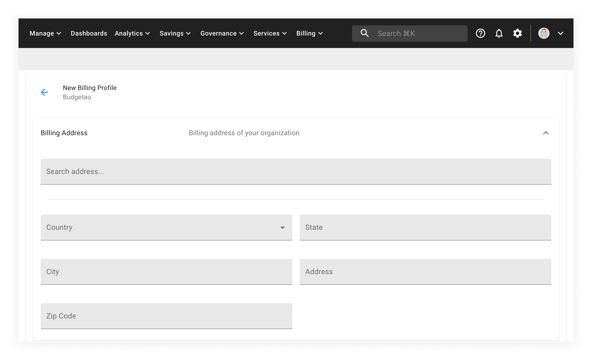
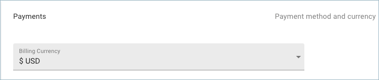

# Change billing currency

If you need to change your company's billing currency, a new billing profile must be registered using the Cloud Management Platform. The currency of existing billing profiles cannot be changed.

From the CMP dashboard, select the three vertical dots icon in the top right-hand corner of the screen and then select _New Billing Profile_.

Selecting this menu item will take you to the _New Billing Profile_ page:

From this screen, you can proceed to fill out the the details of your new billing profile.

After completing all the required fields, you will be asked what billing currency you would like to use.

You may choose between the following payment methods and currencies; The following currencies are currently supported:

* :flag\_us: USD (United States Dollar)
* :flag\_eu: EUR (The Euro)
* :flag\_gb: GBP (Pound sterling) &#x20;
* :flag\_il: ILS (Israeli Shekels)
* :flag\_au: AUD (Australian Dollar)
* :flag\_dk: DKK (Danish krone)
* :flag\_no: NOK (Norwegian krone)
* :flag\_se: SEK (Swedish krona)
* :flag\_br: BRL (Brazilian real)
* :flag\_sg: SGD (Singapore dollar)
* :flag\_mx: MXN (Mexican peso)

Available payment methods are:

* **Wire transfer** (IBAN/SWIFT)
* **Credit card** (1.5% processing fee may apply)
* **Bill.com**
* **ACH** payment

After completing the form, select the _SUBMIT_ button to create your new billing profile.
