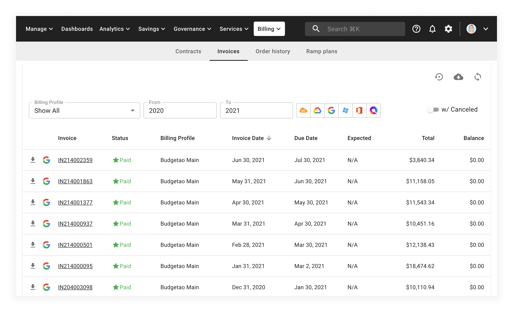

# Get Invoice Reconciliation File

As a customer, you can access your company invoices as well as download the invoice summary as a CSV file.


Required Permissions: **Invoice Viewer**


Within the CMP, select _Billing_ from the top menu bar, then select _Invoices_:

From the _Invoices_ page, you can download invoice data in CSV format by clicking the download icon (a cloud with a down arrow) in the top-right corner of the page.
