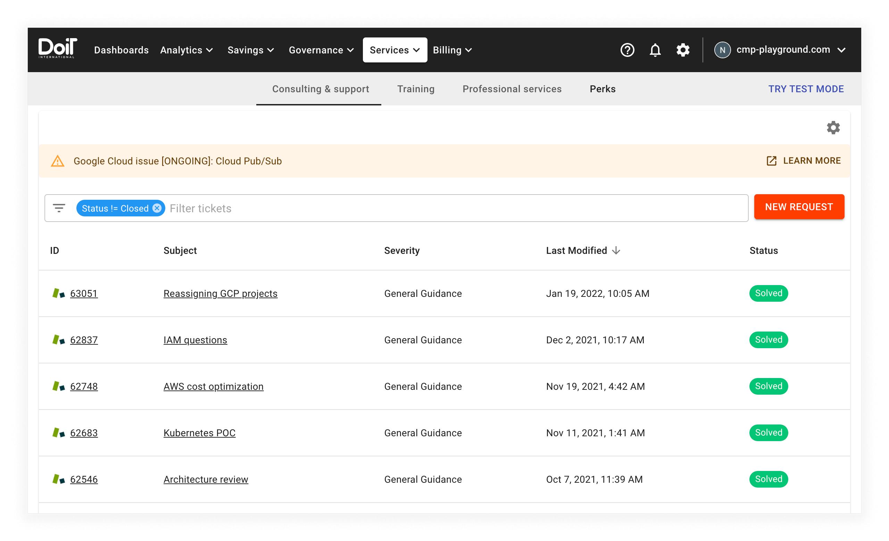

# Cloud incidents

_Cloud incidents_ are defined as any faults or defects with Google Cloud, Amazon Web Services, or Microsoft Azure services that may impact the performance or availability of your applications.

From within the CMP, select _Governance_ from the top navigation bar, then select _Cloud incidents_. This page is the primary location for viewing cloud incidents.

You can use the _Filter known issues_ input field to filter the list of cloud incidents.

Select the _VIEW_ button to view the details of a specific cloud incident.

In addition, any active cloud incidents will be shown at the top of the list of [support tickets](README.md):

