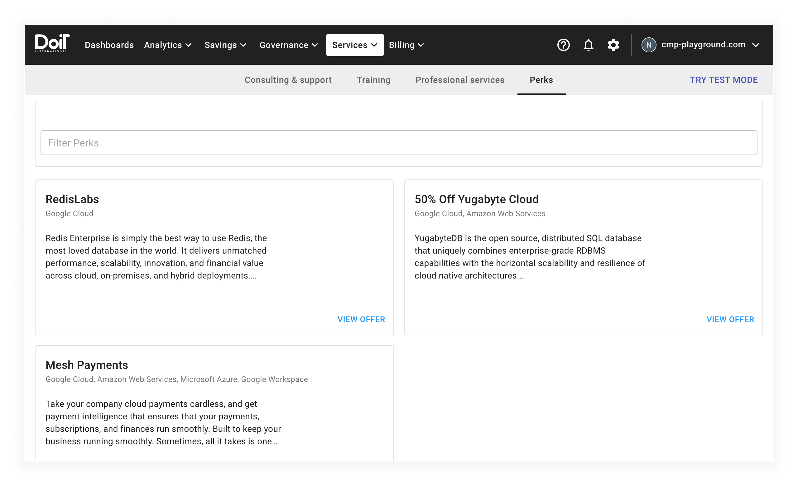
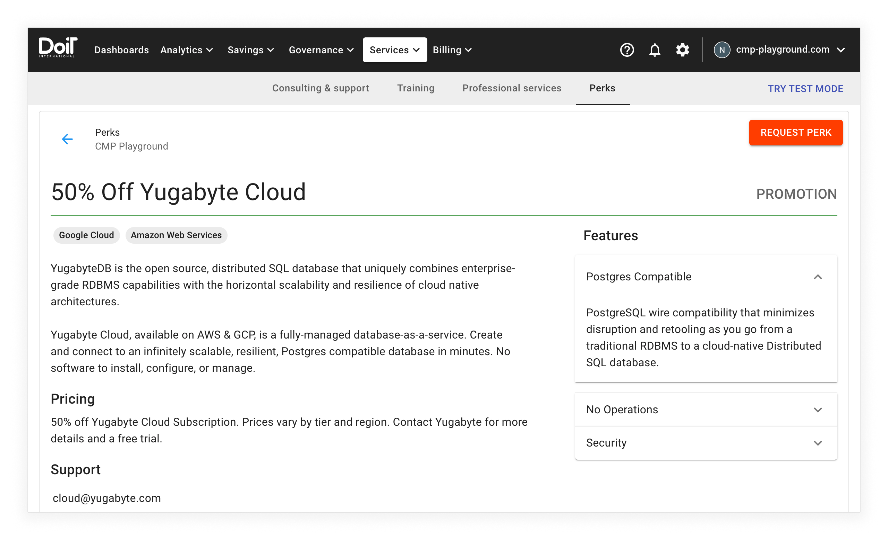

# Perks

Perks are service-based benefits available on-demand for DoiT International customers at no extra cost, including promotions, special offers, and price packages.

## View offers

From within the CMP, select _Services_ from the top navigation bar, then select _Perks_:

The _Perks_ page shows you a list of all the currently available offers your team can request. Select the _VIEW OFFER_ button to see more details.

## Request a perk

After selecting the _VIEW OFFER_ button, the CMP will take you to a page with details of the perk:

To request the perk for your team, select the _REQUEST PERK_ button in the top right-hand corner.

After selecting _REQUEST PERK_, the CMP will display a status message and email you to confirm your request.

All perk requests result in a [support ticket](consulting-support/README.md), and we will contact you with more information. Please feel free to use the support ticket to ask any questions you may have.

Watch this bite-sized video for a closer look at [training](training.md), [professional services](proserv.md), and perks:


