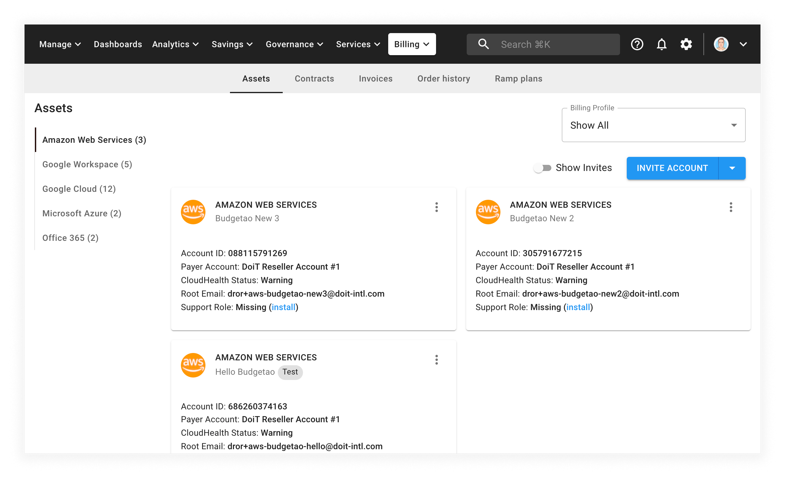

# Invite Existing AWS Account

You can add existing AWS accounts to DoiT International's consolidated billing using the Cloud Management Platform.


Required Permission: **Licenses Manager**



Please note that you must be assigned access to the specific Billing Profile under which the domain is managed in order to invite an existing account.


Within the CMP, select _Billing_ from the top navigation bar and then select _Assets_. The CMP will take you to the _Assets_ page.

From the _Assets_ page, select _Amazon Web Services_ from the left-hand menu:

From the Amazon Web Services assets page, select the _Invite Account_ button.

The CMP will open a modal dialog:

Then:

1. Select the billing profile you would like to invite
2. Enter the 12-digit AWS Account ID
3. Add invitation notes (optional)

When you are done, select _Invite_.

You should then receive an email from Amazon Web Services with a link to accept the invitation:

If you haven't received the above email within five minutes, please re-enter your AWS Account ID in the DoiT Cloud Management Platform and send the invite again.

To complete the process, sign in to the [AWS Organizations Console](https://console.aws.amazon.com/organizations/). On the Invitations page in the console, you can see your open invitations to join organizations:

Finally, select the _Accept_ button to accept the invitation.

Afterward, you will be redirected to the _Organization overview_ page that provides details about the organization that your account has joined. You can view the organization's ID and the owner's email address.

## Multiple Accounts Under a Master Organization

In the event that you have multiple accounts under a Master account / organization, you will get an error trying to accept the invitation.

In order to successfully accept the invitation, you must remove each linked AWS account from your master account.


Note: This will prompt you to input payment details for each linked account if you didn't do so while initially creating them.


For each account you must:

1. "Leave" the Organization (no new invites will appear before you do this)
2. Accept the invite from DoiT International in each linked account

## Completing IAM Access for CloudHealth

After signing in to the AWS Console and accepting the invitation, a final email will be sent instructing how to complete the IAM access for CloudHealth.

## Frequently asked questions

### Why should I use the CMP for cost analytics when Amazon provides the AWS Cost Explorer?

When you consolidate with the DoiT International billing organization, the [AWS Cost Explorer](https://aws.amazon.com/aws-cost-management/aws-cost-explorer/) can only report on [blended rates and costs](https://docs.aws.amazon.com/awsaccountbilling/latest/aboutv2/con-bill-blended-rates.html#Blended_CB). On the other hand, the CMP's reporting and analytics features work directly with your non-blended cost data.

If you have a dedicated billing account (i.e., non-consolidated), you can use the AWS Cost Explorer with un-blended costs. However, we still recommend that you refer to the CMP for a fully integrated reporting and analytics experience.

### I've performed all the requested steps. I have spends on my AWS billing account, but my information is still not there. What could be the reason?

Once successfully completed it takes 24&ndash;72 hours for the data to start flowing through from AWS, then our Cloud Management Platform will update.

### I have not received any invitation email. What could have gone wrong?

On your organization's page, check if you can see the invite:

If you can't see that invite, check if you have left your organization as specified in the above "Multiple Accounts Under a Master Organization" steps.

If you can see the invite on the organization's page, consider the following:

Is the invite in your spam folder? Did you enter the correct AWS account ID when inviting the account?

If you are still having issues, you can [open a support ticket](https://hello.doit-intl.com/support).

### My payer account is showing as N/A or my CloudHealth status shows as "critical" or "unknown". What does that mean?

It means that your CloudHealth configuration was not done properly.

**Actions to take:** please [open a support ticket](https://hello.doit-intl.com/support) if you see the CloudHealth status as "critical" or "unknown", or if you see Payer Account: N/A.

**The consequences are the following:**

* Our Cloud Management Platform is not able to properly reflect your reservation data, and you cannot use the FlexSave and Spot Scaling services.
* It also means you will not be able to run reports on this asset, the reason being that the data is not flowing to our platform.

### I want historical backfill. What should I do?

If you would like historical backfill so that your data prior to joining DoiT is shown, please follow these steps:

1. Verify that [cost and usage reports](https://docs.aws.amazon.com/cur/latest/userguide/cur-create.html) are enabled by visiting your AWS [Billing & Cost Management Dashboard](https://console.aws.amazon.com/billing/home#/), then selecting _Cost & Usage Reports_ from the left-hand menu.

   You must have an existing report configured under _Cost and Usage Reports_ before we can backfill your data.

2. Within the CMP, please open a [support request](../services/consulting-support/README.md) requesting that we backfill your data. You will need to provide access to the S3 buckets where the cost and usage report files are stored along with the associated `manifest.json` file.
