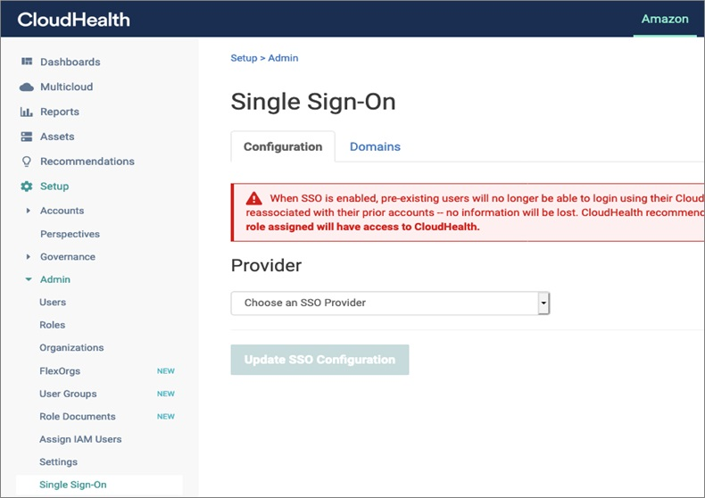

# Set up CloudHealth

Please use the following instructions to setup [CloudHealth](https://www.cloudhealthtech.com) for your new or existing AWS account linked to DoiT International consolidated billing.

## Sign in to AWS Console

Sign in to the AWS account you'd like to integrate with CloudHealth with an IAM account which has the permission to create AWS IAM roles and policies.

## Create an AWS IAM Policy

1. Navigate to [IAM Policies](https://console.aws.amazon.com/iam/home?region=us-east-1#/policies)
2. Click "Create Policy"
3. Switch to the JSON tab
4. Remove existing content and copy the content of [this JSON policy](https://storage.googleapis.com/hello-static-assets/cloudhealth/iam-policy.json) and paste it into the text area
5. Click "Review Policy"
6. Set name to "CloudHealth"
7. Click "Create Policy"

## Create an IAM Role

1. Navigate to [IAM Roles](https://console.aws.amazon.com/iam/home?region=us-east-1#/roles)
2. Click "Create Role"
3. Select 'AWS Account'
4. Provide `454464851268` as Account ID
5. Mark "Require external ID" and paste `6cda262029ad7b34a64ff537196ab4`
6. Click "Next: Permissions"
7. Search and select "CloudHealth" IAM Policy
8. Click "Next: Tags"
9. Click "Next: Review"
10. Set Role Name to "CloudHealth"
11. Click "Create Role"

## Create Users

The first user will be an administrator we create for you.

Further users and administrators can be created by yourself in the [CloudHealth Interface](https://apps.cloudhealthtech.com/users) as an Admin.

If you are yourself not an admin, you need to approach an admin in your company to do this.

If you require any further assistance with the creation of the CloudHealth IAM Role, don't hesitate to contact our support at [https://support.doit-intl.com](https://support.doit-intl.com)


If you have SSO enabled in CloudHealth, you will not be able to add users that use usernames and passwords. In order to add users they must first be added to the proper role group within the IDPs directory.


See also: [AWS Single Sign-On Service Integration Guide For CloudHealth](https://www.cloudhealthtech.com/blog/aws-single-sign-on-service-integration-guide-for-cloudhealth)
