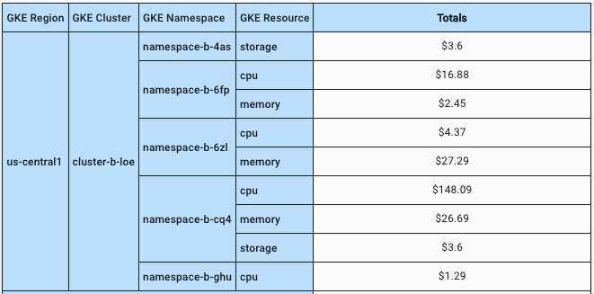

# Report Dimensions, Group By, and Filters

**When creating reports in Cloud Analytics, you will have every billing dimension to choose from, including any custom, project, and system labels for a detailed view of your cloud spend. You can also further customize your reports by grouping or filtering these dimensions.**

When you first create a new report, you will see an interface like this:

**Dimensions** determine the fields along the X-axis of the chart and **"Group by"** determines the fields along the Y-axis of the chart.

In the screenshot below you can see that projects are being grouped along the vertical axis, and project data is being displayed along the horizontal axis. The year, month and day have been added as "Dimensions" so the data/columns are displayed along the horizontal axis.

**Filters** allow you to view more specific information. For example, if you only want to look at GCP, you can Filter on Cloud = GCP without having to show AWS on the chart.

## Standard Dimensions

> **Account**
>
> This dimension refers to the "Billing Account" in CMP &mdash; Assets for Google Cloud; Cloud health account ID and Cloud Health name for AWS

> **Cloud**
>
> This reflects the cloud provider either "Google Cloud" or "Amazon Web Services"

> **Cost Type**
>
> The Cost Type dimension helps to identify the type of charge covered for a specific charge item. For example with AWS this helps distinguish between RI fees, usage fees, saving plan fees, taxes (if applicable) and so on.

> **Credit**
>
> A credit is usually a cloud provider's way of implementing discounts such as Committed Use Discount or Sustained Use Discount or free-tier usage of a service

> **Folder**
>
> Folder can contain projects, other folders, or a combination of both. For example, your organization might contain multiple departments, each with its own set of Google Cloud resources. folders allow you to group these resources on a per-department basis.

> **Operation**
>
> The specific AWS operation covered by this line item. This describes the specific usage of the line item. For example, a value of `RunInstances` indicates the operation of an Amazon EC2 instance.

> **Project**
>
> This dimension refers to the AWS Account ID; whereas for Google Cloud this identifies the Project ID

> **Region, Country, Zone**
>
> These dimensions refer to the cloud location specific to the Region, Country, or Zone where resources are deployed.
>
> [Google Cloud Locations &mdash; Regions & Zones](https://cloud.google.com/about/locations/)
>
> [AWS Regions and Availability Zones](https://aws.amazon.com/about-aws/global-infrastructure/regions_az/)

> **Resource**
>
> At the lowest level, resources are the fundamental components that make up all Google Cloud services. Examples of resources include Compute Engine Virtual Machines (VMs), Pub/Sub topics, Cloud Storage buckets, App Engine instances. All these lower level resources can only be parented by projects, which represent the first grouping mechanism of the Google Cloud resource hierarchy.

> **Service**
>
> A service is the high-level "type" of cloud technology that can be broken down into SKUs. A SKU is the resource itself for which there's a given price per unit.

> **SKU**
>
> The ID of the resource used by the service. For the full list of SKUs, see the [Pricing table report](https://cloud.google.com/billing/docs/how-to/pricing-table)t

> **Unit**
>
> The "Unit" dimension corresponds to the "Usage" Metric. This varies by service but generally refers to their unit of measure. e.g. Core - "hour"; Ram - "gigabyte hour"; EC2 - "vCPU-Hours"

## Date / Time

> **Year | Month | Day**
>
> By default, when you create a new report, the "**Year**", "**Month**", and "**Day**" dimensions would already be added as shown on the example image below.

> The Date/Time dimension is also linked to the display option "**Time Interval**", thus the selection here will add/remove a Date/Time dimension accordingly. For example, when Time Interval "Hour" is selected, "Hour" will also be automatically added to the dimensions.

## Labels

Labels are key-value pairs that are used for identifying, organizing and grouping resources which helps with tracking cloud spend. They can be either user-defined or generated by the cloud provider or DoiT.

For added granularity, when creating reports in CMP, you will see labels dimension in different categories:

"**Labels**" in general refer to the cost allocation tags for AWS and labels for Google Cloud as assigned to resources

"**Project Labels**" are specific to Google Cloud for labels that were set on the project level

"**System Labels**" refer to labels that were systematically generated by DoiT or AWS and Google Cloud


For AWS, not all cost allocation tags are automatically imported in CMP. Please submit a [support request](../../services/consulting-support/README.md) if you have any new tags that needs to be added in your reports.


"**GKE Labels**" become available only when [GKE Cost Analytics](../gke-cost-analytics.md) has been successfully configured. These are [_labels applied at the cluster level_](https://cloud.google.com/kubernetes-engine/docs/how-to/creating-managing-labels#about\_labeling\_clusters) _and_ propagates to all of the cluster's individual resources (such as nodes and persistent disks).


You cannot combine both Google Cloud Labels and GKE Labels in the same report.


## GKE Dimensions

If [GKE Cost Analytics](https://help.doit-intl.com/cloud-analytics/gke-cost-analytics) has been configured, additional dimensions will be available in Cloud Analytics Reports for reporting on GKE spend.

The four GKE dimensions \[Namespace, Cluster, Region, and Resource] add levels of granularity to the report which helps you better understand the real costs of running Kubernetes-based workloads on Google Kubernetes Engine.

> **GKE Namespace**
>
> The Kubernetes namespace from which the usage is generated.

> **GKE Cluster**
>
> A cluster is the foundation of Google Kubernetes Engine (GKE): the Kubernetes objects that represent your containerized applications all run on top of a **cluster**.

> **GKE Region**
>
> The Google cloud region in which the GKE nodes are running at/resides

> **GKE Resource**
>
> The GKE resource in use, such as "cpu", "memory", and "storage".

Below is a sample report snippet with a full breakdown of the four GKE dimensions:

