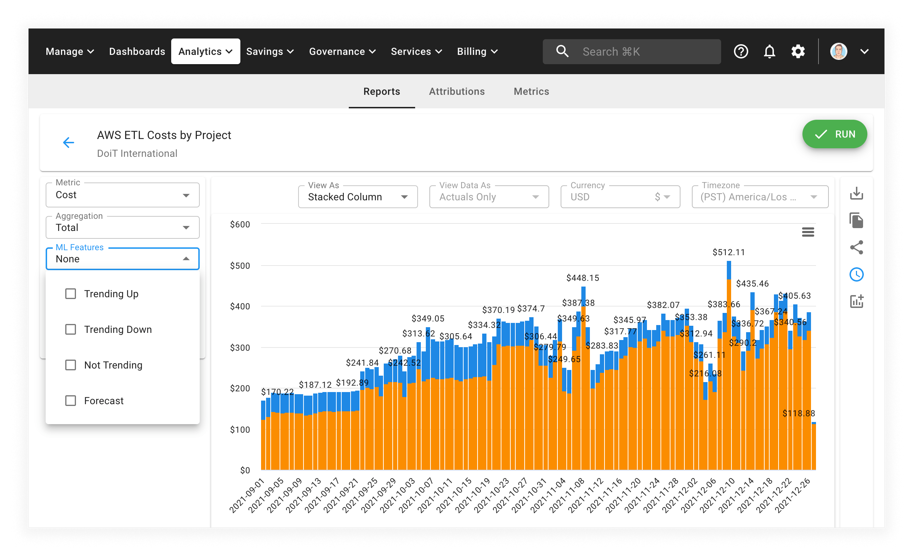

# Forecasting

Being able to forecast your future cloud costs is important when trying to stay within your planned budgets.

With _forecasting_ in Cloud Analytics Reports, you'll answer questions like _"How much I am going to pay Google Cloud/AWS this month?"_ or _"How much I will spend on BigQuery and Pub/Sub during the next 90 days?"_ in just one click.

## Generate a forecast

Use forecasting in your Cloud Analytics reports by selecting the _Forecast_ option from the _ML Features_ drop-down menu on the left-hand side of the report:

When you select this option, the CMP will generate a forecast line which estimates what your costs may look like for the period you selected moving forward.

For example, if you selected "Last 30 days" under the _Time Range_ dropdown, your forecast will display cloud cost estimates for 30 days looking forward.

## Forecasting incomplete data

Because billing data can lag behind (sometimes by 12&ndash;36 hours), you can also use the forecasting feature to get an idea of what to expect your missing cloud costs will be.

Watch this short video explainer for more information:


