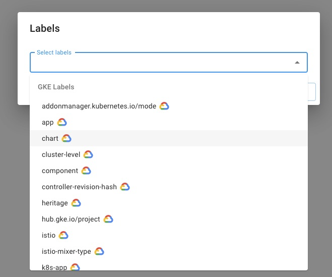

# GKE Cost Analytics

GKE Cost Analytics in the CMP helps you demystify your Google Kubernetes Engine (GKE) spend. With real-time visibility into GKE spend, you'll be able to:

* Accurately track TCO of Kubernetes-based workloads across teams, product lines, etc.
* Plan better with realistic Kubernetes-based [budgets](manage-budgets.md)
* [Forecast](forecasting.md) and [identify trends](trend-analysis.md) across any/all K8s primitives in one click.

Enabling GKE Cost Analytics involves three main steps:

1. Connect your Google Cloud Organization by uploading a service account
2. Enable GKE Usage Metering for your GKE clusters in the Google Cloud console or CloudSDK
3. Grant the "BigQuery Data Viewer" role to the service account (generated in step 1)


You may have already executed some or all of these steps. However, unless ALL steps have been taken, the GKE Cost Analytics feature will not function correctly in the DoiT CMP.



GKE Cost Analytics is not applicable to **Autopilot clusters** because they currently do not support Usage Metering feature as noted [here](https://cloud.google.com/kubernetes-engine/docs/concepts/autopilot-overview#unsupported\_cluster\_features).


## Step 1 &mdash; Enable the GKE Cost Analytics

In order to do this, you will need to [connect your Google Cloud Organization](../google-cloud/connect-google-cloud-service-account.md) to the CMP. Please navigate to the Settings page via the gear icon in your left-hand navigation panel.

Then check the box(es) of the additional features you'd like to enable, making sure to select "GKE Cost Analytics" here.

Click on the "Create Service Account" button. This will display all of the Google SDK ([gcloud](https://cloud.google.com/sdk)) commands you need to run sequentially to create the service account that contains the permissions for all of the features you checked.

Finally, once you've executed all of the commands, select the _UPLOAD KEY_ button to upload the service account to the CMP.


Remember the service account email you created in this step. You will need it for step three.


## Step 2 &mdash; Enable GKE Usage Metering in the Google Cloud Console

First, you will need to create a BigQuery dataset in the Google Cloud console, and then configure your clusters to export their resource usage to it.

After that, you can enable GKE usage metering on a new or existing cluster, using either the [`gcloud`](https://cloud.google.com/kubernetes-engine/docs/how-to/cluster-usage-metering#gcloud) command or the [Cloud Console](https://cloud.google.com/kubernetes-engine/docs/how-to/cluster-usage-metering#console).

You can find a more detailed description of these steps in the Google Kubernetes Engine [documentation](https://cloud.google.com/kubernetes-engine/docs/how-to/cluster-usage-metering#enabling).



1. You can set multiple clusters in your project to write to the same BigQuery dataset.
2. Clusters can export usage data only to BigQuery datasets in the same project.



## Step 3 &mdash; Grant the "BigQuery Data Viewer" role

In order to do this for each GKE usage dataset you've created, you will need to ensure this role is assigned to the Service Account email created in [Step 1](gke-cost-analytics.md#step-1-enable-the-gke-cost-analytics-feature-in-the-doit-cmp) above.

First, navigate to the BigQuery console and locate the dataset you chose from [Step 2](gke-cost-analytics.md#step-2-enable-gke-usage-metering-in-the-google-cloud-console) to store the cluster usage information.

From there, select "Share Dataset"

Then enter the service account email in the "Add members" field. Finally, grant this email the "BigQuery Data Viewer" role and click "Add", then "Done" to apply the changes.


Note: Datasets to which the Service Account email is not granted this permission will not be available in the GKE Cost Analytics feature of the DoiT CMP.


## Step 4 &mdash; Make sure you have the Kubernetes Engine API enabled


If you created the CMP service account in `Project A`, then "Kubernetes Engine API" needs to be enabled in the project in which you created the CMP service account, `Project A.`


## Analyzing GKE Cost Data in the CMP

Once everything is set up, your team's GKE metering data can be analyzed using the CMP's [Cloud Analytics](create-cloud-report/) functionality.

To start, open a new Report. You should see new GKE dimensions appear alongside your other billing dimensions, as highlighted below.

You will also find any GKE labels in the Labels chip, under the "GKE Labels" header in the dropdown.

Drag a GKE chip or a GKE label chip into the "Group By" or "Dimensions" section to start understanding the real costs of running Kubernetes-based workloads on Google Kubernetes Engine.

## Current Limitations

* GKE Reports will only show data from the day that all of the steps were completed. We may be able to load historical data upon request (i.e. "backfill"). Please contact support to file a backfill request.
* If you did not have "GKE Usage Metering" enabled until now, we will not be able to show historical data for GKE reports.
* It will take a few hours from the moment you complete all steps until you will be able to use GKE Reports in Cloud Analytics. Usually, this process will take around 4 hours.
* GKE reports are not compatible with some of the dimensions. For example, you will not be able to create a report that is based on the "GKE Cluster" field and the "Zone" field. You also cannot combine both Google Cloud Labels and GKE Labels in the same report.
