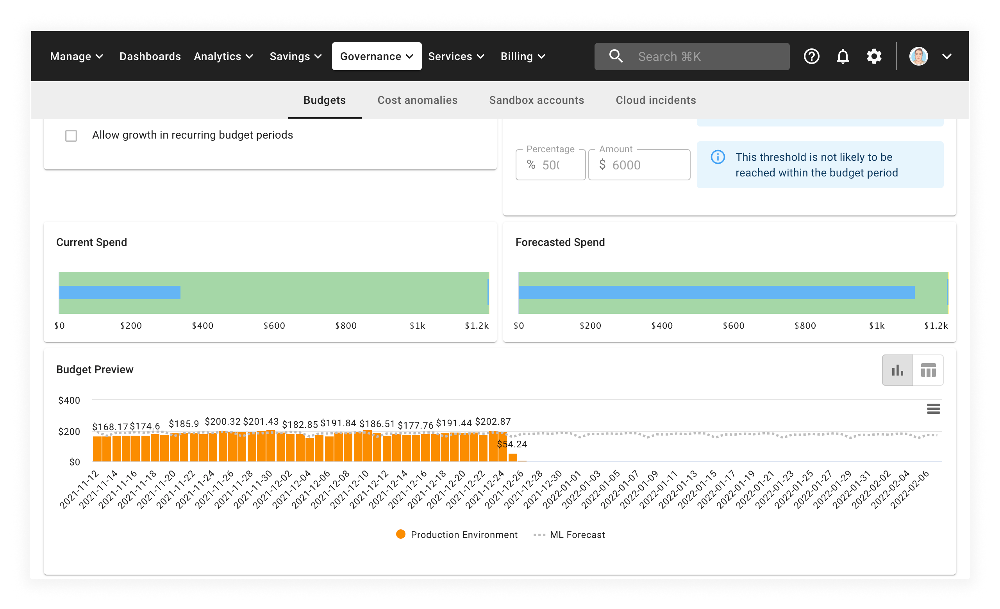
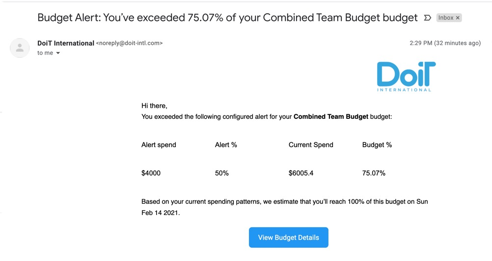

# Manage budgets


**Note:** If you're new to budgets and/or aren't familiar with Attributions we recommend reading our post on [_Creating Attributions_](attributing-cloud-spend.md) before reading further.


Setting budgets and forecasting IT spend is a well-established FinOps practice, ensuring that you won't get surprised by your cloud bill.

Within the Cloud Management Platform, you can set budgets using [Attributions](attributing-cloud-spend.md), custom-defined groupings of cloud resources (accounts, services, etc.) that map to your organizational and financial reporting structure.


Required Permissions: **Cloud Analytics**


## Creating budgets

Go to the _Budgets_ page by selecting _Governance_ from the top menu bar, then selecting _Budgets_:

To create a new budget, select the _NEW BUDGET_ button in the top right-hand corner of the screen.

## Configure your budget

After selecting _NEW BUDGET_, you will be taken to the budget creation form:

Give your budget a suitable name and the budget's scope by selecting the attributions your budget will be allocated to.

As mentioned elsewhere, [attributions](attributing-cloud-spend.md) let you group any combination of cloud resources (and their associated costs) so you can better relate cloud costs to your financial reporting structure.

Next, select the budget type, time interval, and start date. If you're configuring a Fixed budget, you'll need to set the end date as well. After defining the above, it's time to set your budget's amount or upper limit. Before entering a number, it might be helpful to see what the last period's cost was for reference.

Select the _Refresh_ icon to view your last period's cost, given the budget scope, time interval, and dates you've selected.

After refreshing and setting a budget amount, two visual bars will appear below:

The two bars represent:

* **Current Spend** &mdash; Your current spend relative to alert thresholds (next section) you've set.
* **Forecasted Spend** &mdash; How much you are forecasted to spend by the end of the budget period.

You will also notice a budget preview that incorporates a machine-learning prediction of future spend.

Lastly, if you're configuring a recurring budget, you have the option to factor in growth in spending for subsequent periods. This will adjust your budget amount in future periods, increasing it by a growth percentage rate set by you.

Enable this by checking the "Allow growth in recurring budget periods" box, and then enter in a % growth rate for each subsequent period.

## Set budget thresholds

After configuring your budget, you can set up to three budget thresholds. By default, thresholds are set at 50%, 85%, and 95% of your budget amount, but you can modify any of the percentages as you wish.

You will see the corresponding amount for each threshold, and the forecasted date that you will reach each threshold.

Setting thresholds is useful especially when setting up budget alerts.


Note: In order to see forecasted dates for budget thresholds, you need to click the "Refresh" button after setting a budget amount.


## Sharing budgets

By default, budgets are only viewable by the creator. Sharing your budget makes it visible to others.

To share your budget, click the "Share" icon in the top right of the "Sharing & Alerting" widget.

This will open a pop-up that will give you two options when sharing:

* Give everyone on your team Viewer access.
* Explicitly give someone from your team Viewer or Editor Access.

Having View access means the budget will appear on the main Budgets page, and that you can view the budget itself &mdash; but you can't make any edits to the budget.

Edit access allows you to edit a budget, but not delete it. Only those with Owner access can delete budgets.

Once you've entered the email(s) of who you're sharing your budget with, click "Add" and then hit "Save" to apply your changes.


Sharing someone on your budget does not mean they will be alerted when usage thresholds are exceeded.


### Changing a user's budget permission

To change a user's permission, make them the owner of the report, or remove them from the report, click on the dropdown next to their email in the Share Budget pop-up.

Then make a selection and click "Save" to apply the changes.

### Configuring alerts for budgets

Alerts help notify yourself and others when you exceed a budget threshold.

To add someone as a recipient of an email alert notification, enter their email in the "Send to" text box in the "Sharing & Alerting" widget. If they haven't been shared on the budget already, you will be asked to share it with them first before being able to subscribe them to the budget's alert.

You will see a confirmation in the lower-left corner of your screen when someone has been successfully subscribed to your budget's email alerts.

### Receiving alerts for budgets

When you exceed a budget threshold, you'll receive an email detailing:

1. Which budget threshold you exceeded
2. Your current spend
3. The forecasted date when you will reach 100% of your budget

Here is what a typical alert looks like:

## Video walkthrough

Watch budgets in action in the video below:


