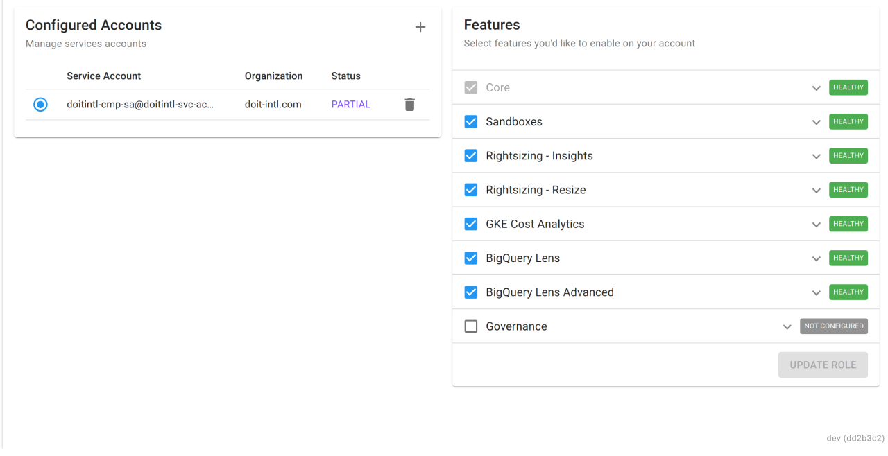

# Rightsizing for Google Cloud

DoiT International makes rightsizing recommendations for Google Cloud assets available through the Cloud Management Platform. Our customers can apply these recommendations, and resize instances to cost optimize their environments.

To use Rightsizing for Google Cloud, you must verify that your service account was successfully uploaded and granted the appropriate permissions. You can read more on how to configure your Google Cloud accounts at [Connect Your Google Cloud Organization.](../google-cloud/connect-google-cloud-service-account.md)

If successful, you will see:

* Either a Healthy or Partial value underneath the Status column in your Configured Accounts widget, and
* Healthy status next to "Rightsizing Insights" under the Features widget, and
* Healthy status next to "Rightsizing Resize" under the Features widget

_This is optional. However, without the permissions granted here, you will have to make the rightsizing changes yourself in the Google Cloud Console, as opposed to doing it in a couple of clicks from the CMP._

_Please note that if the status reads 'Unhealthy', you may be lacking permissions. Refer back to the_ [_Connect Your Google Cloud Organization_](../google-cloud/connect-google-cloud-service-account.md) _article on how to configure your account._

Once that's been set up, you can add the 'Recommendations' widget to any of your dashboards within the Cloud Management Platform.

Navigate to the dashboard you'd like to add the widget to, locate the 'Add Widgets' button and search for 'Recommendations' and add the widget to your dashboard.

If the Service Usage API is disabled in your cloud environment, you'll need to enable it via the 'Click Here' button within the widget. Once you do so, confirm the action by clicking on 'I Have Enabled The Service'.

Recommendations for cost savings will now be presented. Click on the recommendation to further inspect the instance.

In this dialog, you will be able to apply the recommendations in order to save costs by changing machine types. DoiT International provides any further recommendations within 24 hours after the change. Afterward, instance recommendations are refreshed at regular intervals throughout the day. To apply the recommendation, stop the instance for the Current machine type that's currently under the status 'Running', then click 'Apply'. You will then be able to start the instance for the New machine type once it reloads.

View the bite-sized video below for a closer look at Rightsizing Google Cloud Instances.


