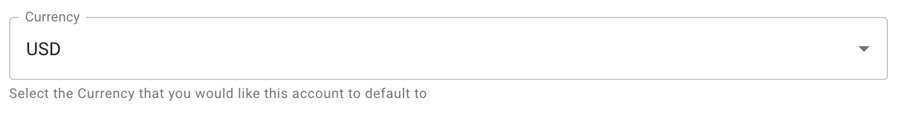

# General Settings

The **General** tab of the Settings section contains options that provide company-specific defaults for all users within the CMP.

## Currency

| Section    | Feature        | Behavior                                                                                                                         |
| ---------- | -------------- | -------------------------------------------------------------------------------------------------------------------------------- |
| Dashboards | Pulse          | Pulse Dashboard will show all reports in your default currency                                                                   |
| Analytics  | Reports        | Currency will be the default timezone for any report in [_Explore_ or _New Report_](../cloud-analytics/create-cloud-report/)\_\_ |
| Analytics  | Budgets        | Currency will be used as the default for any newly [created Budget](../cloud-analytics/manage-budgets.md#creating-budgets)       |
| Governance | Cost Anomalies | Cost Anomalies will show in configured default currency                                                                          |
| Savings    | FlexSave       | FlexSave will show in configured default currency                                                                                |

Changing this value will immediately apply the setting to your account and requires no additional save action.
