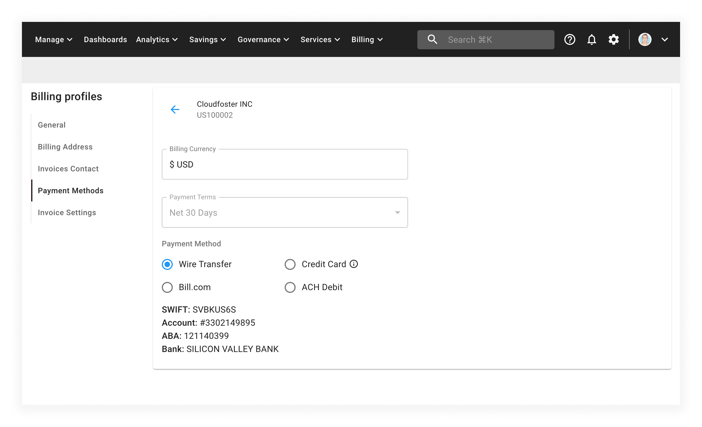

# Update Payment Method

You can configure the Payment Method for your organization using the Cloud Management Platform.

The payment methods available depend on your currency and country. In many countries, you can set up a credit card, debit card, or bank account as a primary payment method.


Required Permissions: **Billing Profile Admin**



Please note that you must be assigned access to the specific Billing Profile under which the domain is managed in order to purchase a license.


From the main CMP dashboard, select the edit icon next to the billing profile you would like to update.

From the billing profile page, select _Payment Methods_ from the left-hand menu:

Assuming that the _Wire Transfer_ setting is enabled and you'd like to switch to paying by credit card, select the _Credit Card_ radio button and enter your card details.

By setting up a credit or debit card, we will process your payments automatically, so you don't have to worry that your services will stop running if you forget to make a payment.

You can also set up a backup credit or debit card as a safety net. That way, if your primary payment method fails, we'll charge your backup payment method. This also helps to ensure that your cloud services keep running.

If you prefer to set your card as the default payment method, select the the _ENABLE_ button next to the card of your choice.

If no card is set as the default for payments, we will not automatically charge you. This means you will have to manually pay your invoices.

For further instructions on how to pay for an invoice, see the [Paying Invoice](paying-invoices-with-credit-card-or-ach.md) documentation.

The following video shows you how to update a billing profile's payment method:


