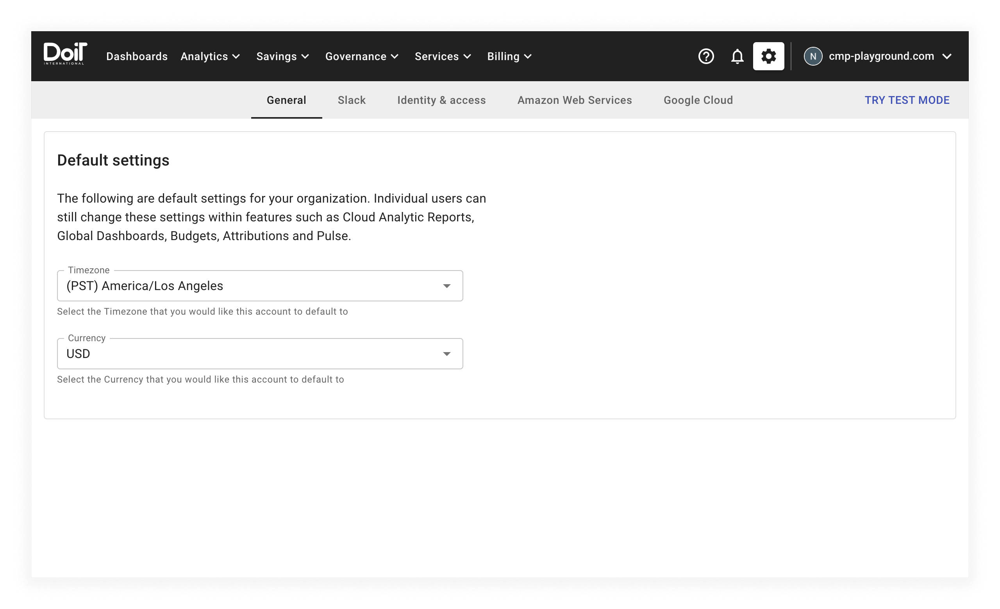

# General settings

Select the gear icon from the top navigation bar to edit organization defaults for all users within the Cloud Management Platform (CMP). The CMP will take you to the _General_ settings screen:

The _General_ settings screen has a form that allows you to configure:

* Your organization's default timezone
* Your organization's default currency

When you edit the value of any form field on this page, the CMP will automatically save your changes.
