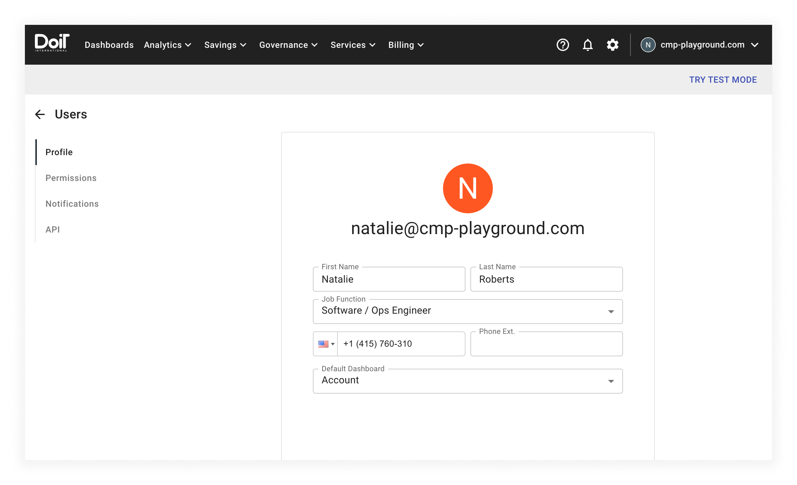
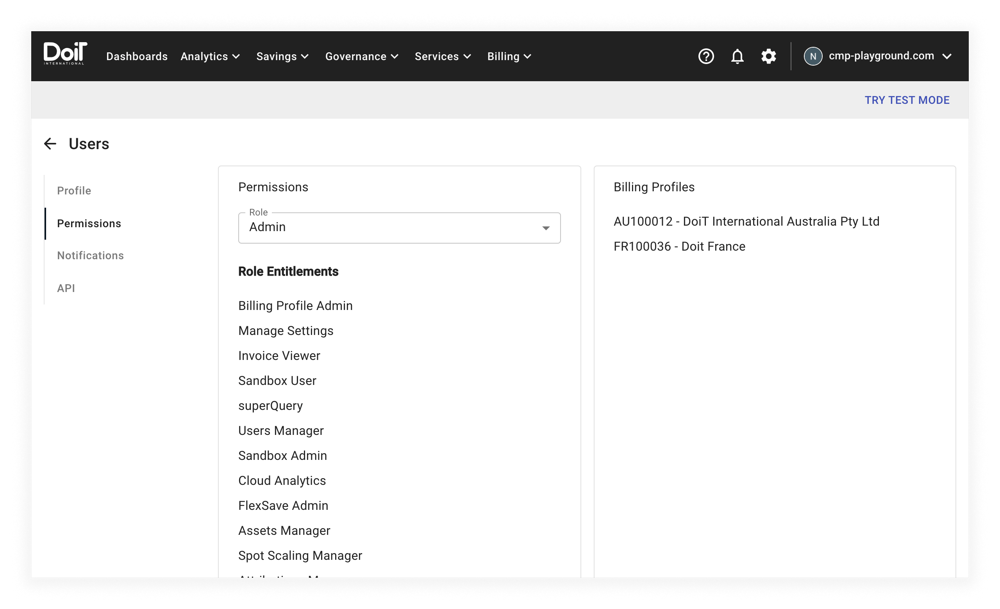
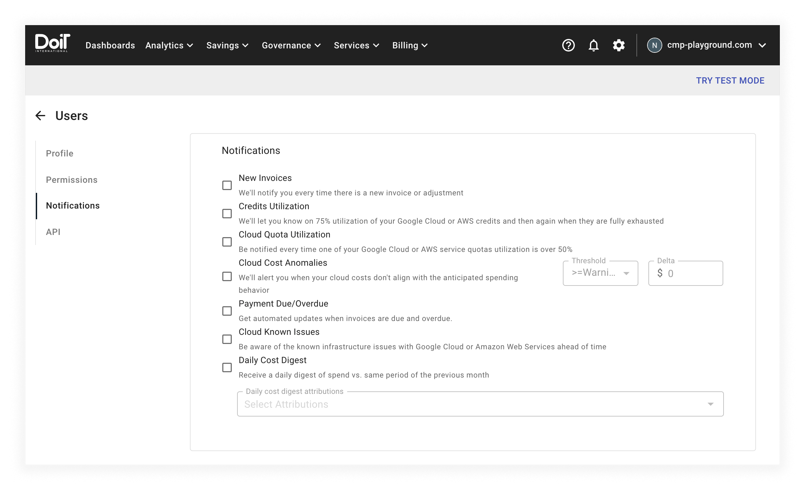
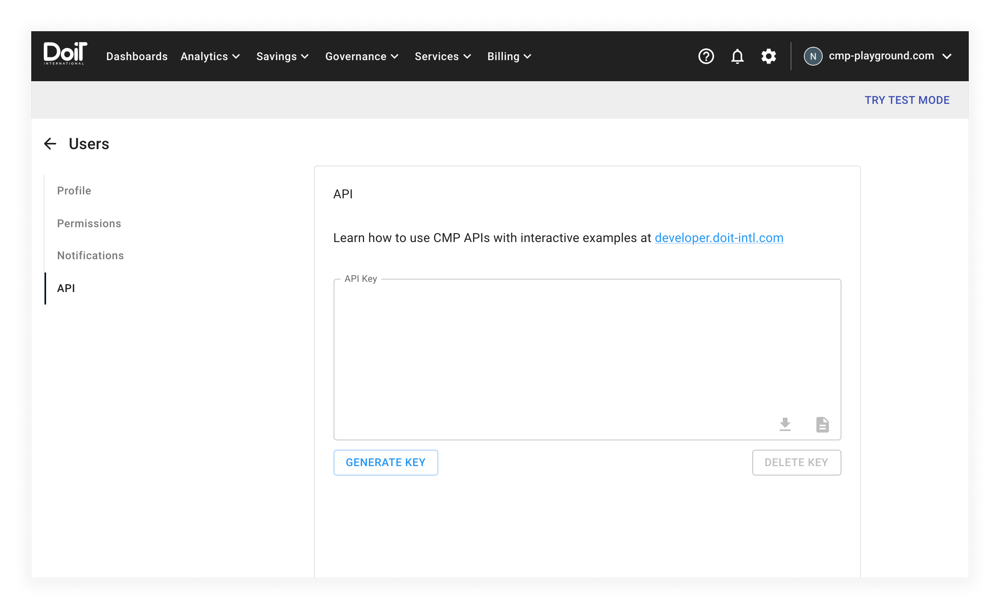

# Your profile

To view your profile, select your account name from the top navigation menu, then select your name at the top of the drop-down menu:

The _Cloud Management Platform_ (CMP) will take you to your _Profile_ page:

The _Profile_ page has a form that allows you to edit the following information:

* _First Name_ and _Last Name_ &mdash; Your display name in the CMP
* _Job Function_ &mdash; Account admins can use job function to help [manage your organization](../user-management/manage-organizations.md)
* _Phone Number_ &mdash; Your international dialing code and local number
* _Default Dashboard_ &mdash; The default [dashboard](../dashboards-and-widgets/customizing-dashboards.md) to display when you first log in

When you edit the value of any form field on this page, the CMP will automatically save your changes.



Admins or users with the [Users Manager](../user-management/user-permissions-explained#users-manager) permission can [edit any user profile](../user-management/creating-a-new-user#editing-user-profiles).



## Permissions

To view your [role](../user-management/manage-roles.md) and associated [permissions](../user-management/user-permissions-explained.md), select _Permissions_ from the left-hand sidebar. The CMP will take you to the _Permissions_ screen:

The _Permissions_ screen includes the following information:

* Your currently assigned role
* A list of your role entitlements (aka permissions)
* A list of your assigned [billing profiles](../invoices-and-payments/setting-up-a-new-billing-profile.md)



Admins or users with the [Users Manager](../user-management/user-permissions-explained#users-manager) permission can edit [user roles](../user-management/manage-roles.md).

Admins or users with the [Billing Profile Admin](../user-management/user-permissions-explained#billing-profile-admin) permission can manage assigned [billing profiles](../invoices-and-payments/setting-up-a-new-billing-profile).



## Notification preferences

To edit your notification preferences, select _Notifications_ from the left-hand sidebar. The CMP will take you to the _Notifications_ screen:

On the _Notifications_ screen, you can opt-in or out of the following notification types:

* **New Invoices** &mdash; We'll notify you every time there is a new invoice or adjustment

* **Credits Utilization** &mdash; We'll let you know on 75% of your Google Cloud or AWS credits and then again when they are fully exhausted

* **Cloud Quota Utilization** &mdash; Be notified every time one of your Google Cloud or AWS service quotas utilization is over 50%

* **Cost Anomalies** &mdash; We'll alert you when your cloud costs don't align with the anticipated spending (configurable with _Threshold_ and _Delta_)

* **Payment Due/Overdue** - Get automated updates when invoices are due and overdue

  * We will send the first reminder seven days before an invoice is due
  * We will send the second reminder four days after the invoice's due date
  * We will send the third reminder 10 days after the invoice's due date

* **[Cloud Known Issues](../services/consulting-support/cloud-incidents.md)** &mdash; Be aware of the known infrastructure issues with Google Cloud or Amazon Web Services ahead of time

* **Daily Cost Digest** &mdash; Receive a daily digest of spend vs. same period of the previous month (configurable with _Daily cost digest attributions_)

  Use the _Daily cost digest attributions_ input to select which attributions you want to include in your daily digest.

  You will receive one email per selected attribution detailing:

  * Previous day's cost
  * Month to date cost (sum costs accrued in the current month)
  * Cost trend (current month cost to date vs. previous month costs for the same date)
  * Forecasted current month cost

  We will send you daily digest emails at 06:00 UTC.

### Default notifications

New users are assigned default notifications tailored to their assigned [role](../user-management/manage-roles.md). These notifications ensure that users are informed about important events related to their job function.

| Role            | Default notifications                                                                                                 |
| --------------- | --------------------------------------------------------------------------------------------------------------------- |
| _Admin_         | Cloud Quota Utilization Cloud Cost Anomalies Payment Due/Overdue Cloud Known Issues Daily Cost Digest |
| _Finance User_  | New Invoices Cloud Cost Anomalies Payment Due/Overdue                                                         |
| _Power User_    | Cloud Quota Utilization Cloud Cost Anomalies Cloud Known Issues Daily Cost Digest                         |
| _Standard User_ | Cloud Cost Anomalies Daily Cost Digest                                                                            |

## API key

You need an API key to use the [Cloud Management Platform API](https://developer.doit-intl.com/).

To manage your API key, select _API_ from the left-hand sidebar. The CMP will take you to the _API_ screen:

To generate a new API key, select the _GENERATE KEY_ button.

After you generate your API key, copy and store it somewhere handy. We won't display your API key again after leaving the _API_ page.



In the bottom right-hand corner of the _API Key_ text box, you can use the icons to copy your API key to your system clipboard or download your API key as a JSON file.



To delete your API key, select the _DELETE KEY_ button.
