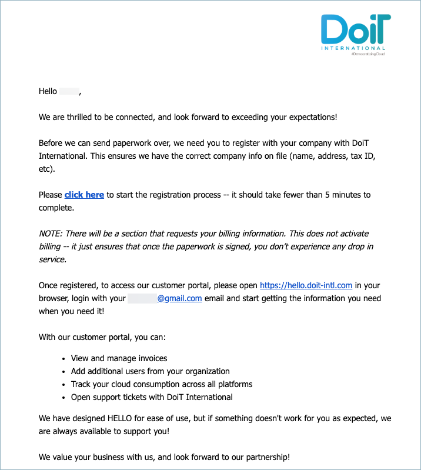

# Company registration

At DoiT International we want to create a seamless customer experience from the very first touch-point to the post-contract stage, and that's why registering your company through our Cloud Management Platform is an integral part of a successful customer onboarding process.

At some point in your communications with DoiT International's Account Management team, you will receive an e-mail to register your company and complete the form (see example below)

Click the link in the email to start the sign-in & registration process. You will be sent to the 'New Billing Profile' section of the customer onboarding process where you will need to fill out your company information, enter your payment method, and select your currency.


Please note that there will be a section that requests your billing information. This does not activate billing, it just ensures that once the paperwork is signed, you don't experience any drop in service.


The following video shows you how to Register your Company.


