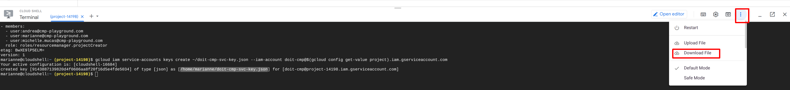

# Link Google Cloud Organization

In order to use many of the functionalities available to you within the **Cloud Management Platform**, we request an extra set of permissions, depending on the features you'd like to use. These permissions allow us to access the Google API and obtain information for monitoring or alerts, and/or help you take action on recommendations.

To grant these permissions, you will need to create a Google Cloud Service Account, set up a Google Cloud IAM Role at the organization level, and upload the key to the Cloud Management Platform. In this article, we'll go over how to do all of the above.


Required Permissions: **Manage Settings**


## Create Google Service Account

From the top menu, select the gear icon (_Settings_) in the upper right-hand corner, then select _Google Cloud_ under _Cloud settings_:

This will take you to the Google Cloud settings screen:

To create a Google Cloud Service account, please execute the following steps:

1. Check the features you'd like to enable within the CMP
2. Review the permissions each service request (by expanding the card)
3. Select on "Create Service Account"

A slide-out will appear on the right-hand side of the screen containing the Google SDK ([gcloud](https://cloud.google.com/sdk)) commands you will need to run in order to create the service account and set it up with the correct role.

Before executing the `gcloud` commands, ensure that you have selected an appropriate project to create your service account. The project should be one that you are planning to keep long-term and that will only be accessible by only trusted people.

Next, copy the commands generated above and run them sequentially in your terminal or Google Cloud Shell.


The `gcloud` commands vary according to the boxes of the features you checked


Once you finished to run the `gcloud` commands, you can download the key in the JSON file for your new service account.



The `gcloud` command achieves the following: the service account is created in one of the projects in your organization, and then the permissions for this service account are given on the organization level.



Congratulations! You have now created a new `doit_cmp_role` linked to the "DoiT CMP Service Account", under your organization.

## Upload the Service Account Key

Whether you've generated your service account key, your next step is to upload the JSON file to the CMP by clicking on "Upload File".

If configured successfully, you should see a "**Healthy**" or "**Partial**" value appear under the "Status" column in the "Configured Accounts" widget.

"**Partial**" will only appear next to your configured service account if you didn't grant permissions for _all_ of the available features. What's important in this case is to examine the "Features" widget and verify that all of the features you selected have a "**Healthy**" status.

If there is something wrong with the JSON file you uploaded, you will see an "**Unhealthy**" value under the "Status" column.

## Updating your Service Account

If, after initially connecting your Google Cloud Organization, you decide that you want to grant permissions for an additional feature &mdash; or remove permissions &mdash; you can do that easily from the same page.

First, check or uncheck the feature(s) you'd like to add or remove. Then select the _Update Role_ button.

A slide-out will appear containing the `gcloud` commands you need to run to update your service account's role so that permissions corresponding to the feature you checked or unchecked are added or removed, respectively.

## Adding Multiple Service Accounts

In the very rare event that you have multiple Google Cloud Organizations, you can upload multiple service account keys to regulate which Organizations get access to which features.

To add a new service account, click on the "**+**" icon in the top-right corner of the _Configured Accounts_ widget on the left-hand side of the screen.

Once clicked, notice that all of the Features will revert back to "Not Configured" since you are setting up a new service account.

As you did with your initial service account, select the features you'd like to grant permissions for this service account, and run the `gcloud` commands provided.

Check out the bite-sized video below for a closer look at connecting your Google Cloud Organization to CMP.


