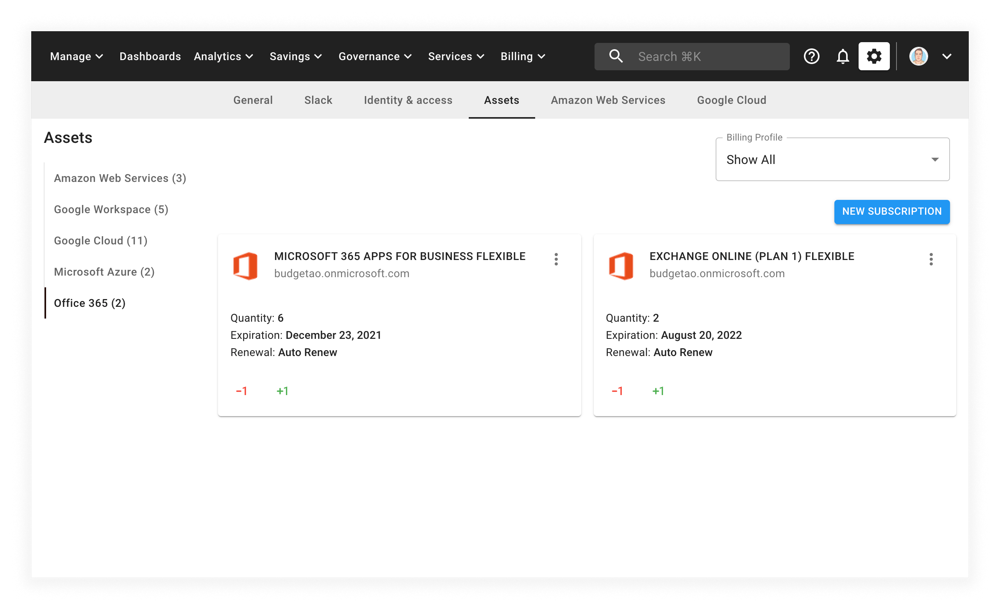

# Create Office 365 Subscriptions

You can add a new Microsoft Office 365 subscription to your existing tenant, using the Cloud Management Platform.


Required Permission: **Assets Manager**



Please note that you must be assigned access to the specific Billing Profile under which the domain is managed in order to purchase a new subscription.


Within the CMP, select _Billing_ from the top navigation bar and then select _Assets_. The CMP will take you to the _Assets_ page.

From the _Assets_ page, select _Office 365_ from the left-hand menu:

To add a new license, select the _NEW SUBSCRIPTION_ button in the top right-hand corner of the page.

Adding a new subscription will take you through a few steps, allowing you to customize your order:

After reviewing your order, select the _SUBMIT_ button to complete the purchase.
