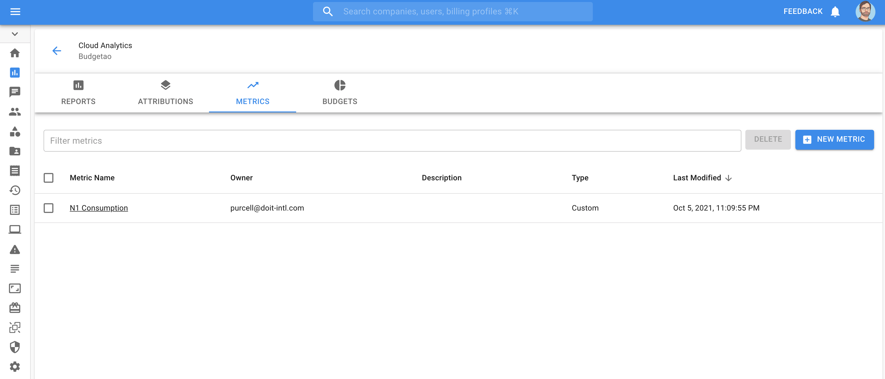
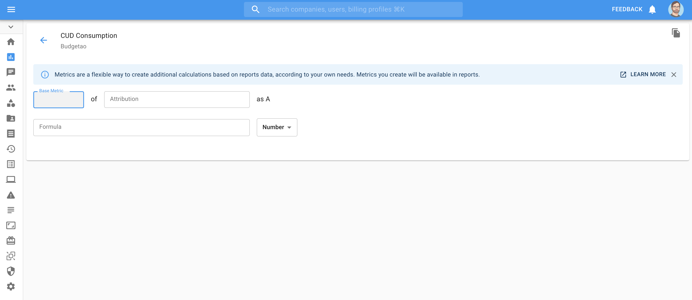

.. _cloud-analytics_custom-metrics:

Custom Metrics
==============

.. epigraph::

   How to use attributions to create custom metrics to track and report on KPIs for your cloud

Overview
--------

Custom metrics allows customers to calculate metrics based on existing :doc:`attributions <attributing-cloud-spend>` within the CMP. Often when reporting on cost and usage for cloud environments the dimensions and metrics in your bill are not sufficient to understand key information. By creating formulas with portions of the bill key indicators of performance can be surfaced more cleanly.

For example:

*
  **Percentage of GCP CUD utilized**

  CUD (committed use discount) Usage / CUD (committed use discount) Commitment

*
  **Amortized Instance Reservation Consumption**

  Monthly Ec2 Instance type usage / (1 yr Reserved Instance type commitment / 12)

*
  **Percentage Shared Infrastructure Cost**

  Shared Infrastructure costs / Total Infrastructure Cost

Custom metrics can be particularly useful when tracking consumption of shared services. Determine what percentage of shared infrastructure is being used by a single app. Determine distribution of compute types across a set of accounts or projects.

Structure of a Metric
---------------------

Custom metrics are created by creating formula's with Attributions. Each Attribution must have a base metric selected for it. This can either be: Cost, Usage, or Savings. For more information, see our :doc:`Metric selection documentation <editing-your-cloud-report>`.

.. image:: ../_assets/custom-metrics-drop-down.png
   :alt: A screenshot showing the Base Metric drop-down menu

For instance, if you want to create a metric to track the percentage consumption of a compute commitment, you will require 2 Attributions.

* Compute Usage
* Compute Consumption.

Please ensure these Attributions are created in advance of metric creation

Create a Metric
---------------

Navigate to :doc:`Cloud Analytics <create-cloud-report/index>`, and select the Metrics tab

Select **'New Metric'**

Provide a name for the new Custom Metric.

Select **Attribution** to set as *A*

Select **'Base Metric'** for Attribution *A*

Repeat as necessary for required attributions

Create a formula to generate the metric desired.

Formulas
^^^^^^^^

Formulas support standard **Order of Operations**

Custom metric formulas support the following operators:

.. list-table::
   :header-rows: 1

   * - Operator
     - Description
   * - ``+``
     - Addition
   * - ``-``
     - Subtraction
   * - ``*``
     - Multiplication
   * - ``/``
     - Division
   * - ``()``
     - Parentheses for grouping

.. NOTE::

   When a valid formula is created it will be automatically saved.

A formula is considered invalid if it is:

#. Empty
#. Invalid Variable Definition

   #. Attribution and/or base metric provide no data
   #. Variable is not complete (no metric selected, no attribution selected)

#. Invalid Formula

   #. Yields an error
   #. Divide by zero
   #. Incorrect formatting

When a valid formula is complete a preview will generate below

Example metric
^^^^^^^^^^^^^^

GCP N1 Commitment Coverage %
^^^^^^^^^^^^^^^^^^^^^^^^^^^^

N1 Commitments / N1 Usage as %

.. image:: ../_assets/CleanShot\ 2021-11-01\ at\ 11.44.56.jpg
   :alt: A screenshot of an example N1 Commitments / N1 Usage as % report

Including Customer Metrics in Cloud Analytics Reports
-----------------------------------------------------

To include a metric in a report, :doc:`create a new report <create-cloud-report/index>`

In the Report configuration panel select *'Metric'*

.. image:: ../_assets/CleanShot\ 2021-11-01\ at\ 11.59.42.jpg
   :alt: A screenshot of the *Metric* drop-down menu

Once selected you will be prompted to confirm your choice

.. image:: ../_assets/CleanShot\ 2021-11-01\ at\ 12.01.53.jpg
   :alt: A screenshot of the *Show N1 Commitment Coverage* modal dialog

Once selected you can build your report as normal with the required attributions and run your report
