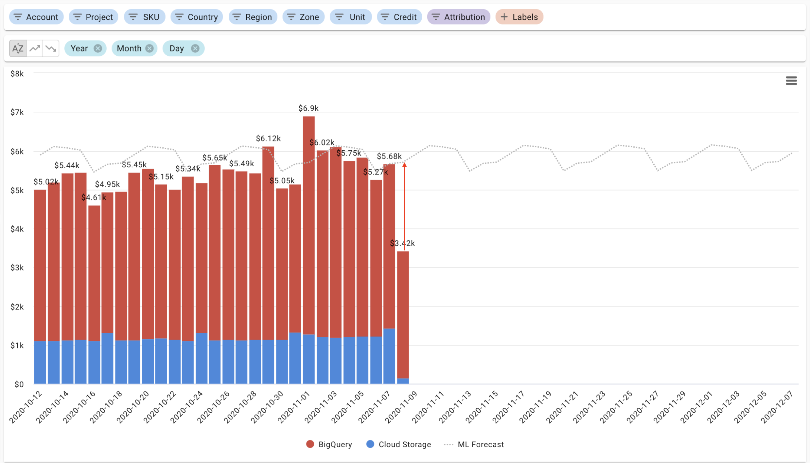

.. _cloud-analytics_forecasting:

Forecasting
===========

.. epigraph::

   How to estimate your future cloud costs.

Being able to forecast your future cloud costs is important when trying to stay within your planned budgets.

With **Forecasting** in Cloud Analytics Reports, you'll answer questions like *"How much I am going to pay Google Cloud/AWS this month?"* or *"How much I will spend on BigQuery and Pub/Sub during the next 90 days?"* in just one click.

Generate a forecast
-------------------

Use Forecasting in your Cloud Analytics Reports by selecting the "**Forecast**" option from the "**ML Features**" dropdown on the lefthand set of options.

.. image:: ../_assets/forecast-side-menu.jpg
   :alt: A screenshot showing you the location of the _ML Features_ dropdown

Once selected, you will see a forecast line which estimates what your costs may look like for the period you selected moving forward.

For example, if you selected "Last 30 days" under the "Time Range" dropdown, your forecast will display cloud cost estimates for 30 days looking forward.

.. image:: ../_assets/forecast-report.jpg
   :alt: A screenshot of a forecast report

Identify incomplete billing data
--------------------------------

Because billing data can lag behind :raw-html:`&mdash;` sometimes by 12-36 hours :raw-html:`&mdash;` sometimes you can get an incomplete picture of your daily cloud costs, .

As shown in the example below, in these situations you can use forecasts to give you an idea of what to expect your cloud costs to be.

Watch this short video explainer for more information

.. raw:: html

   
<iframe src="https://www.loom.com/embed/51439d799674427eba2b2f3a7b26cd87" style="top: 0; left: 0; width: 100%; height: 100%; position: absolute; border: 0;" allowfullscreen scrolling="no" allow="encrypted-media;"></iframe>

