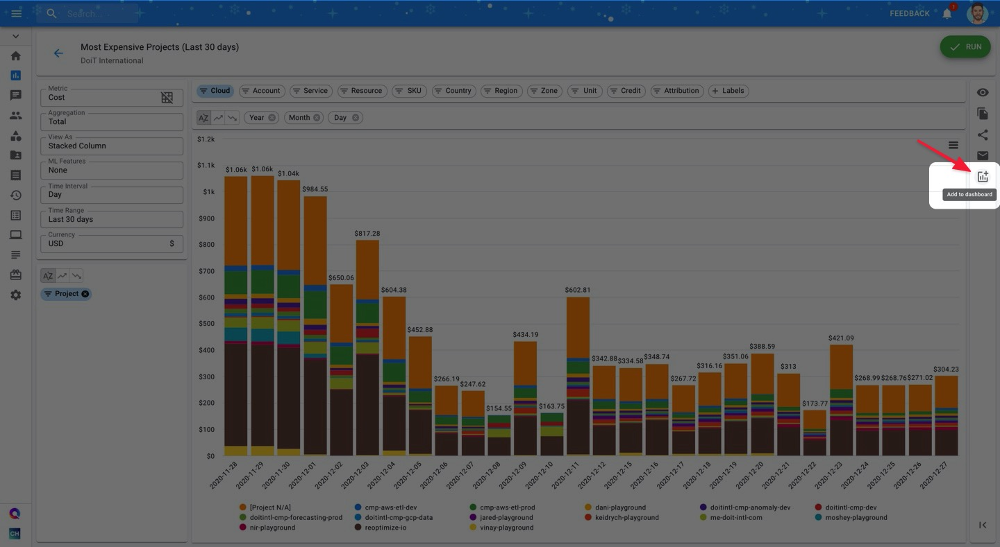

.. _dashboards_add-reports-to-dashboards:

Adding Reports to a Dashboard
=============================

.. epigraph::

   Cloud Analytics Reports can be made available as widgets and used to build dashboards.

CMP Dashboards help you visually track and analyze key cloud data points & metrics. Create personal dashboards, project dashboards, team-specific dashboards and more, depending on what you would like to track more closely.

Adding :doc:`Cloud Analytics Reports <../cloud-analytics/create-cloud-report/index>` into :doc:`customizable dashboards <customizing-dashboards>` gives you an at-a-glance view of your most important cloud infrastructure data points.

.. IMPORTANT::

   Required Permissions: **Cloud Analytics** (part of 'Standard User' preset role)

Add your report to a dashboard by clicking the 'Add to dashboard' icon in the upper right-hand corner of the report.

.. NOTE::

   Only chart-based reports can be added to your dashboards. Table-based and heat-map based reports are currently not supported in dashboards.

Next, select which dashboard(s) you'd like to add the report to. You may also toggle the report to be addable from the :doc:`Widget Library <widgets-overview>`.

.. image:: ../_assets/addwidgetsnew2.jpg
   :alt: A screenshot showing you the _Add to dashboard_ options

Additionally, you may also add a report to a new, yet-to-be-created dashboard. To add the report to a new dashboard, click on the "**NEW DASHBOARD**" button, give your dashboard a name, and click "**Save**".

.. image:: ../_assets/new-dashboard.jpg
   :alt: A screenshot showing you the location of the _Save_ button

Check the box of the newly-created dashboard to add your report there as well.

.. image:: ../_assets/new-dashboard-2.jpg
   :alt: A screenshot showing you the checkbox for your new dashboard

Next, navigate to your dashboard(s) to view the report(s) you added.

From there, you're free to :doc:`customize <customizing-dashboards>` the size and arrangement of the widgets as you see fit. Note that report data displayed in the widget will refresh every four hours.

.. image:: ../_assets/customizewidgetdashboard.gif
   :alt: An animated screenshot showing you how to customize your dashboard

Finally, if you'd like to quickly navigate to your report to investigate further or edit something, you may click on the report's name in the widget.

.. raw:: html

   
<iframe src="https://www.loom.com/embed/4f125260e1214c6f9b85002ca13e6ade" style="top: 0; left: 0; width: 100%; height: 100%; position: absolute; border: 0;" allowfullscreen scrolling="no" allow="encrypted-media;"></iframe>

