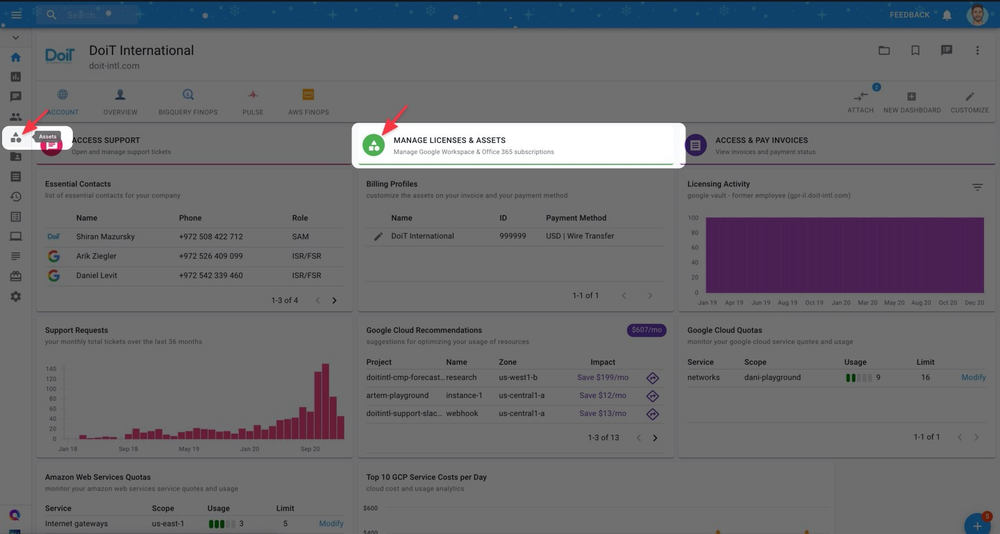
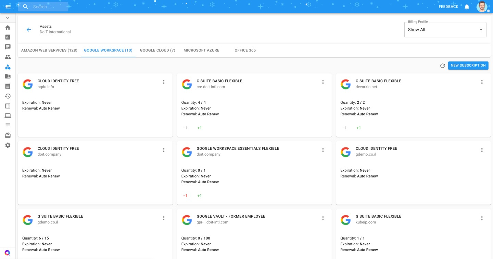
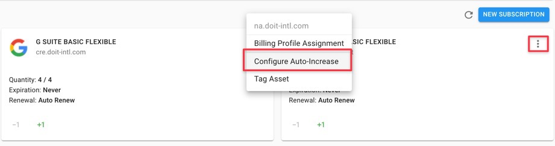

.. _g-suite-and-workspace_configure-auto-increase-for-google-workspace-subscriptions:

Set Licenses to Auto-Increase
=============================

.. epigraph::

   Set your Google Workspace seats to auto-increase when you've exhausted all available licenses

Auto-increase for Google Workspace ensures that you'll always have enough licenses available as your team scales.

All you have to do is set a threshold for the minimum number of Workspace licenses you'd always like to have available. Let's see how to set this up!

.. ATTENTION::
   At a minimum, to manage Google Workspace licenses, your :doc:`User Role <../user-management/manage-roles>` must contain the following permission:

   * Assets Manager

.. ATTENTION::

   *Please note that you must be assigned access to the specific Billing Profile under which the domain is managed in order to configure auto-increase.*

Start by navigating to your Assets page either via the left-hand navigation bar or the "Manage Licenses & Assets" shortcut.

Once you're at the Assets page, switch to the Google Workspace tab.

Locate the subscription you'd like to configure auto-increase for, and click on the ellipsis icon on the right-hand side of the widget. Then choose 'Configure Auto Increase'.

Configure the number of licenses you want to have available at all times. Once licenses get assigned to users in your organization, a new license(s) will be added automatically.

.. image:: ../_assets/image\ (20).png
   :alt: A screenshot showing the Configure Auto-Increase modal dialog

After you click "Save" you will see a success message in the lower-left corner of your screen, confirming your adjustment. Our system will check for and add, if necessary, additional licenses every 30 minutes.

The following video shows you how to Configure Auto-Increase for G Suite Subscriptions:

.. raw:: html

   
<iframe src="https://www.loom.com/embed/be1b3ebbd165446799b53653487774e7" style="top: 0; left: 0; width: 100%; height: 100%; position: absolute; border: 0;" allowfullscreen scrolling="no" allow="encrypted-media;"></iframe>

