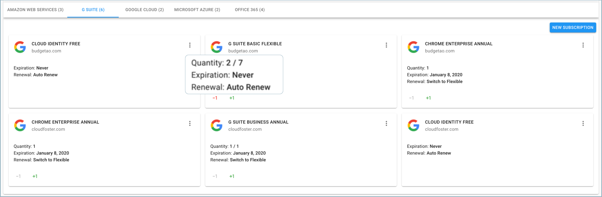

.. _g-suite-and-workspace_purchasing-g-suite-licenses:

Purchasing G Suite Licenses
===========================

.. epigraph::

   Add more licenses to your existing G Suite or Google Workspace subscriptions.

If you"re on the Annual or Flexible plans and use up all your licenses, you can easily purchase more. We increase your monthly payment to cover the new licenses.

.. IMPORTANT::

   Required Permission: **Assets Manager**

.. ATTENTION::

   Please note that you must be assigned access to the specific Billing Profile under which the domain is managed in order to purchase a license.

Start with accessing the G Suite based Assets from the menu on the left-hand side of the page and clicking on Assets.

.. image:: ../_assets/assets-icon-1-\ (4)\ (5)\ (5).png
   :alt: A screenshot showing the location of the _Assets_ menu item

Once you're at the Assets page, switch to the G Suite tab.

![A screenshot showing the location of the *G Suite* tab(<../_assets/g-suite (2) (2) (2) (1).png>)

Locate the subscription you'd like to add licenses for and click the **+** icon to add as many licenses as needed.

.. image:: ../_assets/g-suite2.png
   :alt: A screenshot of available licenses

Add up to as many licenses as you wish, and click 'Apply'.

.. image:: ../_assets/apply.png
   :alt: A screenshot of a license card with an _Apply_ button

Finally, you may approve the purchase by clicking the 'Approve' button.

.. image:: ../_assets/approve.png
   :alt: A screenshot of the _Add Licenses_ modal dialog with an _Approve_ button

**Understanding License Utilization:**

You can see the number of licenses in use under the *Quantity* field, versus how many are available. In the following example, two licenses are in use from seven licenses available.

**Decreasing the Number of Licenses:**

It is possible to decrease the number of licenses that are not in use. By doing this, you will not have to pay for the licenses available if you aren't planning to use them. The charges will be deducted from your account as reflected in the next month's billing to your organization.

Please note that only FLEXIBLE plans allow you to decrease the number of licenses. For more information, please review `this post <https://support.google.com/a/answer/6154359>`__.
