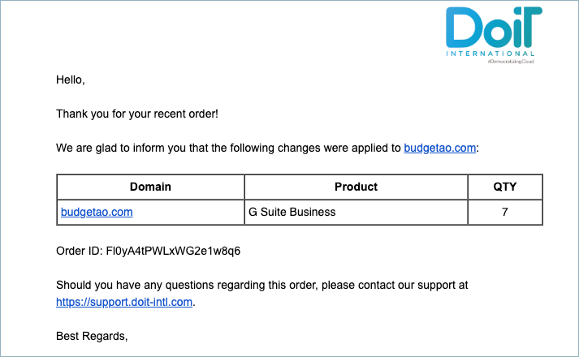

.. _g-suite-and-workspace_upgrading-your-g-suite-edition:

Upgrading G Suite Subscription
==============================

.. epigraph::

   With DoiT International you can seamlessly upgrade to a higher tier G Suite or Workspace subscription.

As a customer, you are able to upgrade your G Suite subscription to get more business features and administrator controls.

.. IMPORTANT::

   Required Permission: **Assets Manager**

.. ATTENTION::

   Please note that you must be assigned access to the specific Billing Profile under which the domain is managed in order to upgrade your subscription.

From the main dashboard please select '**Manage Licenses & Assets**'.

.. image:: ../_assets/new-manage-licenses-2-\ (1)\ (1).png
   :alt: "Manage Licenses & Assets"

Once you're at the Assets page, switch to the G Suite tab.

.. image:: ../_assets/g-suite\ (2)\ (2)\ (2)\ (1)\ (1).png
   :alt: A screenshot showing the location of the _G Suite_ tab

To upgrade to a higher edition, locate the G Suite subscription for which you want to upgrade, and click on the three-dots icon on the right-hand side of the widget. Then choose 'Change G Suite Edition'.

.. image:: ../_assets/change-g-suite-edition.png
   :alt: A screenshot showing the location of the _Change G Suite Edition_ option

Upgrade options:

* G Suite Basic to Business or Enterprise edition
* G Suite Business to Enterprise edition

Select the G Suite edition you'd like to upgrade to, and click on 'Submit'.

.. image:: ../_assets/g-suite-business.png
   :alt: A screenshot showing the _Change g Suite Edition modal dialog

An email notification confirming your recent order will be sent to you.

