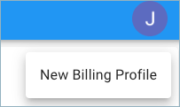
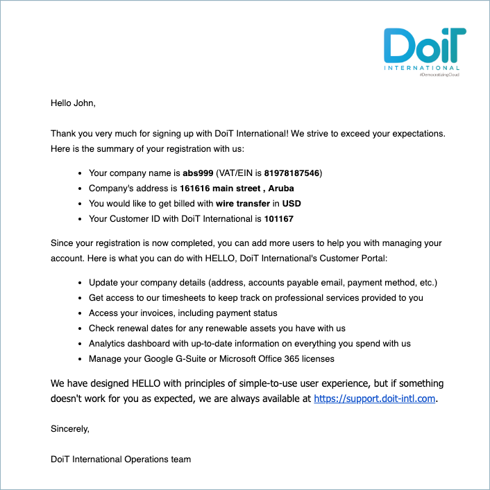
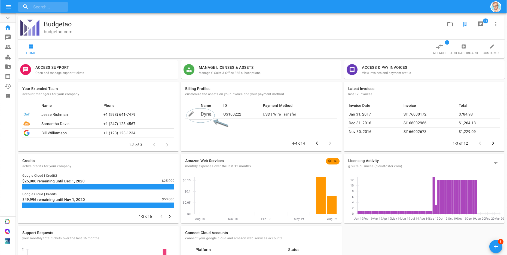

.. _invoices-and-payments_setting-up-a-new-billing-profile:

Set up a New Billing Profile
============================

.. epigraph::

   Billing Profiles are for when your company has different entities requiring separate invoices. They help you customize the way each entity is invoiced.

As a customer, you are able to set up a New Billing Profile for your organization apart from other billing profiles.

.. IMPORTANT::

   Required Permissions: **Billing Profile Admin**

From the main dashboard, locate the three-dots icon on the right-hand side of the page and click 'New Billing Profile'.

.. image:: ../_assets/more-vert-icon.png
   :alt: A screenshot showing you the location of the _three-dots_ icon

Once there, you will be prompted to 'New Billing Profile' and start filling out the information about your company.

.. image:: ../_assets/create-new-billing-profile-2-\ (1).png
   :alt: A screenshot showing you the _New Billing Profile_ form

After completing all the required fields in each section, you will be asked what payment method you'd like to use: Credit Card, Bill.com, Wire Transfer, or ACH Payment.

Click **Submit** after you fill out the details.

.. image:: ../_assets/payment-method-and-currency\ (1)\ (1)\ (1)\ (1).png
   :alt: A screenshot showing you a completed form and the location of the _Submit_ button

If you receive the following error, please try again.

.. image:: ../_assets/invalid-account.png
   :alt: "Invalid Accounts Payable email address"

After the successful submission of a New Billing Profile, an automatic email notification will be sent to the email address placed in the Billing Profile details. Here is an example below.

At the beginning of the month, you will receive an invoice for the New Billing Profile you registered for services used in the previous month.

The new Billing Profile is now visible in your Home dashboard.

