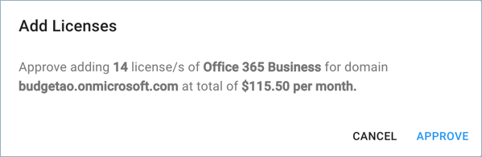

.. _microsoft-office-365_purchasing-office-365-licenses:

Purchasing Office 365 Licenses
==============================

.. epigraph::

   Add more licenses to your existing Microsoft Office 365 subscriptions.

If you manage your Office 365 licenses with DoiT International, you can easily purchase more. We increase your monthly payment to cover the new licenses.

.. IMPORTANT::

   Required Permission: **Licenses Manager**

.. ATTENTION::

   Please note that you must be assigned access to the specific Billing Profile under which the domain is managed in order to purchase a license.

Start by accessing your Office 365-based Assets from the menu on the left-hand side of the page and clicking on Assets.

.. image:: ../_assets/assets-icon-1-\ (4)\ (5)\ (5).png
   :alt: A screenshot showing you the location of the _Assets_ menu option

Once you're at the Assets page, switch to the Office 365 tab.

.. image:: ../_assets/office-365-tab1.png
   :alt: A screenshot showing you the location of the _Office 365_ tab

Locate the subscription you'd like to add licenses for and click the **+** icon to add as many licenses as needed.

.. image:: ../_assets/office-365-tab.png
   :alt: A screenshot showing you the location of the _+_ icon

Add up to as many licenses as you wish, and click 'Apply'.

.. image:: ../_assets/office-flexible.png
   :alt: A screenshot showing you the location of the _Apply_ button

Finally, you may approve the purchase by clicking the 'Approve' button.

**Understanding License Utilization:**

You can see the number of licenses in use under the *Quantity* field. In the following example, four licenses were purchased.

.. image:: ../_assets/office-quantity.png
   :alt: A screenshot showing you the quantity of purchased licenses

**Decreasing the Number of Licenses:**

It is possible to decrease the number of licenses. The charges will be deducted from your account as reflected in the next month's billing to your organization.

Please note that only FLEXIBLE plans allow you to decrease the number of licenses. For more information, please review `https://docs.microsoft.com/en-us/office365/admin/subscriptions-and-billing/buy-licenses?view=o365-worldwide <https://docs.microsoft.com/en-us/office365/admin/subscriptions-and-billing/buy-licenses?view=o365-worldwide>`__.
