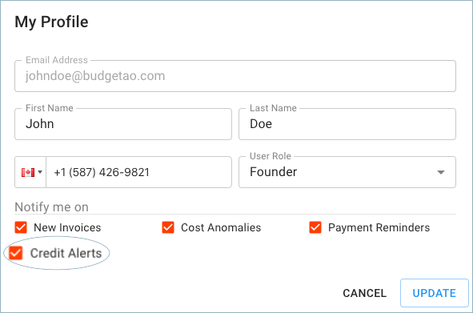
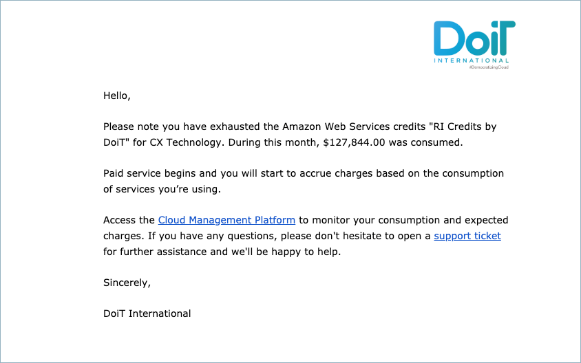

.. _notifications_cloud-credits:

Cloud Credits Notifications
===========================

Customers can be notified when credits on their cloud accounts are due to be exhausted, and additionally, once they have exhausted, by enabling the alerts for 'Credit Alerts' in the profile section of the Cloud Management Platform.

In order to enable or disable the notification itself, click your profile icon in the upper-right corner of the page header, then select **Profile**.

.. image:: ../_assets/profile-1-\ (2)\ (3)\ (3)\ (1)\ (3).png
   :alt: A screenshot showing the location of the _Profile_ option

In the Profile dialog, you will find the '**Credit Alerts**' notification setting.

Below are two examples of credit alerts email notifications we will send out:

When the credit is due to end.

.. image:: ../_assets/credits-due-to-end.png
   :alt: A screenshot of a notification email

When the credit has exhausted.

