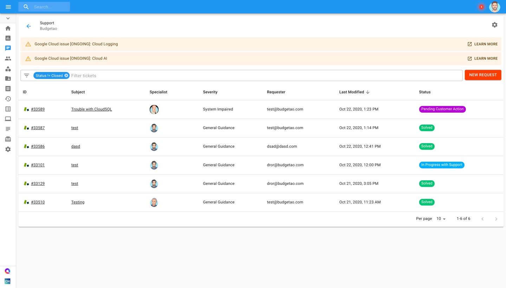

.. _tickets_escalating-support-requests:

Escalating Support Requests
===========================

.. epigraph::

   Notify Cloud Engineering team about the impact on your business

If you would like to access and review previously submitted support requests, you can easily do so through the Cloud Management Platform.

Start with locating the ticket you'd like to escalate on the `Support page <https://support.doit-intl.com>`__:

By clicking on the ticket's subject or ID, you are brought to a new page which includes the ticket's full description and in-depth details displayed in a collapsible Info Panel.

Click on the 'Escalate' button to escalate the ticket and specify the reason for escalation.

.. image:: ../_assets/support4-2.jpg
   :alt: A screenshot showing the location of the _Escalate_ button

Available Escalation Reasoning:

* Long Resolution Time
* Business Impact
* Technical Expertise
* Other

Once you select the reason for escalation, you can also add comments further explaining and justifying the escalation.
