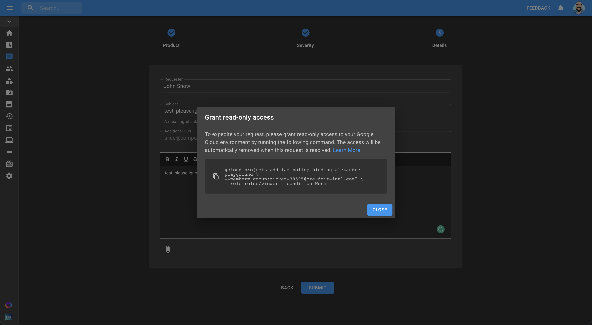

.. _tickets_gcp-ro-access:

Read-Only Access to GCP
=======================

.. epigraph::

   how to securely grant DoiT International access to your Google Cloud project

DoiT International is committed to access transparency and access approval. When you open a technical support request with DoiT International, we may need to access your Google Cloud project so we could help you in the most effective way.

Important to Know
-----------------

* Your Google Cloud project is not accessed for any reason other than to fulfill contractual obligations
* Valid business justification required for any access by our engineering personnel
* Approve or dismiss requests for DoiT employees access, working to support your service

How does it work?
-----------------

When you request technical support and create a new service request with DoiT International, you will be offered to grant DoiT International engineer read-only access to the Google Cloud project set in your request.

A typical access grant is implemented with a ``gcloud`` command (part of `Google Cloud SDK <https://cloud.google.com/sdk>`__). The access is always read-only, limited, and provided only to DoiT International engineers that are handling your request.

.. code-block:: text

   gcloud projects add-iam-policy-binding cassandra-db-prod-289507 \
   --member="group:ticket-38432@cre.doit-intl.com" \
   --role=roles/viewer --condition=None

For example, the above command, grants read-only access (``--role=roles/viewer``) to a group of engineers assigned with request #38432 (``--member="group:ticket-38432@cre.doit-intl.com"``) to your Google Cloud project ``cassandra-db-prod-289507``.

We will generate the command for you automatically and display it to you on the support center user interface.

Revoke Access
-------------

For information security reasons, once the ticket is resolved, the access is automatically revoked. Next time you will create a request, you will need to provide DoiT International with access again.
