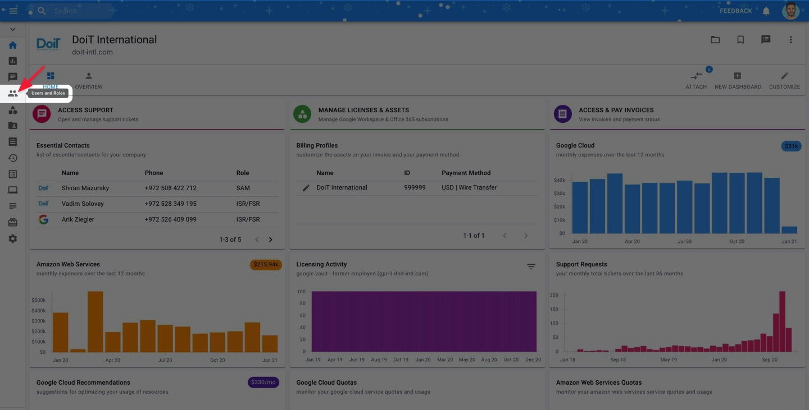
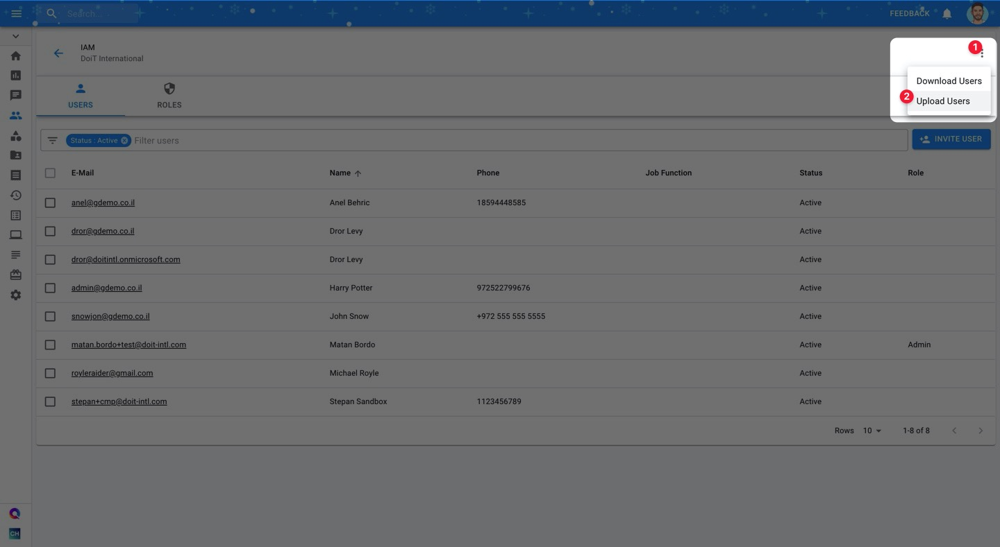

.. _user-management_bulk-invite-users:

Bulk Invite Users
=================

.. epigraph::

   How to bulk invite users to Cloud Management Platform from CSV

Whether you're just creating your team in the CMP or simply want to add a lot of new teammates at once, bulk inviting users will save you lots of time here. From within the CMP, you can invite as many users as you want by uploading a CSV file.

Begin by navigating to the **Users and Roles** page.

Then, at the top-right corner of the page, click on the vertical ellipsis (:raw-html:`&vellip;`). Next, click on "Upload Users" and upload a CSV file with your user information.

To ensure your CSV file is structured properly, we recommend downloading the template below and using it to format your bulk invitations.

.. highlights::

   :raw-html:`&#x1f4ce;` :download:`User Bulk Invite Template <../_assets/flex-ri-bulk-upload-template.csv>`
