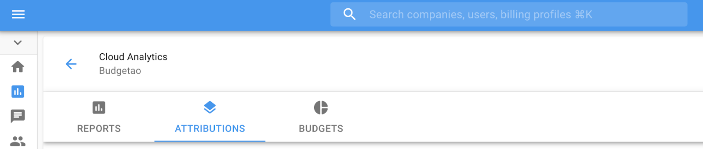

.. _user-management_manage-organizations:

Manage Organizations
====================

.. epigraph::

   This page describes how to create, manage, and use Organizations within the CMP to segment your data and provide greater focus to your users.

.. _manage-organizations_overview:

Overview
--------

Organizations are a feature within the DoiT CMP which allows users to create isolated segments of their data. Over time this feature will empower customers to centrally manage their public cloud while decentralizing the management of each section. These segments are defined using attributions allowing for very flexible and dynamic control.

Today CMP supports Role based access control (RBAC) functionality that enables application admins to limit the permissions of some users within a team. Organizations are a step beyond this allowing customers to represent their organizational structure, business units, and other groupings within the CMP.

Organizations are used to provide a tightly scoped Cloud Analytics experience for a sub-set of your users. By creating an organization, you can help focus its members by automatically scoping all reports to only the attributions used to create it. For instance, if you have a department or group that operates independently within your company (an acquisition, or R&D initiative), you can use organizations to provide a focused experience within the CMP. By removing the noise of total company spend, insights and trends can be brought into focus faster and with less effort.

.. IMPORTANT::

   Required permission to create and manage Organizations: **User Manager**

Terminology
-----------

Organization
^^^^^^^^^^^^

An organization is an automatic set of :doc:`attributions <../cloud-analytics/attributing-cloud-spend>` that filter data for its members. When a user is a member of an organization all reports in Cloud Analytics are automatically filtered to show only relevant data

Root Organization (The default organization)
^^^^^^^^^^^^^^^^^^^^^^^^^^^^^^^^^^^^^^^^^^^^

Every company has a default organization named after their primary domain. This organization, by default, sees all data within a company. It can be restricted by attribution by editing it. When an organization with members is deleted, its users are placed in the default organization rather than being given full access to the company. This allows you the ability to configure a restricted landing zone for users when deleting existing organizations.

Member
^^^^^^

When a user is assigned to an organization, they are said to be a member of that organization. Once a member, they will see only data included in the configured attributions while in Cloud Analytics or Dashboards (:doc:`with the exception of Global Dashboards <manage-organizations>`)

.. _how-to-setup-organizations:

How to Setup Organizations
--------------------------

Organizations use attributions to control what data is included.

.. _step-1-configure-attributions:

Step 1. Configure Attributions
^^^^^^^^^^^^^^^^^^^^^^^^^^^^^^

Navigate to Cloud Analytics :raw-html:`&rarr;` Attributions

If you already have an attribution configured, select it and confirm that it matches the set of data you would like to use as an organization.

:doc:`Please click here to learn more about attributions <../cloud-analytics/attributing-cloud-spend>`

.. _step-2-create-an-organization:

Step 2. Create an Organization
^^^^^^^^^^^^^^^^^^^^^^^^^^^^^^^

Navigate to the Users and Roles menu and select the "Organizations" Menu

.. image:: ../_assets/organizations-menu.png
   :alt: A screenshot showing the Organizations menu

Select "New Organization":

.. _step-3-configure-your-organization:

Step 3. Configure your Organization
^^^^^^^^^^^^^^^^^^^^^^^^^^^^^^^^^^^^

.. image:: ../_assets/organization-configuration-screen.png
   :alt: A screenshot showing the organization configuration screen

Select the attribution or set of attributions that define your organization.

#. Select the Attributions you want to use to scope this organization
#. Select the users that will be members of the organization

   .. NOTE::

      A user can only be a member of a single organization.

#. Select your options for Dashboard Visibility
#. [Optional] Advanced Option

   #. Disable Custom Dashboards -

      #. Use this option if you do not want any data exposure via dashboard widgets. When checked it will remove the ability for users within an organization to customize dashboards and add widgets.

.. NOTE:: **Dashboards and Widgets**

   The preset dashboards in CMP (Account, AWS FinOps, BigQuery FinOps, and Pulse) have a global scope. Regardless of organization, they always show data from across all configured accounts/projects. If you do not want organization members to see data outside their scope, you can prevent them from seeing these dashboards

.. _widgets-function-differently:

Widgets function differently
----------------------------

For each widget there are two concerns

#. Do you have access to the widget?

   #. Roles in the CMP control what widgets you are able to access.
   #. For instance: the Support Viewer Role provides access to the support tickets graph widget in the Account Dashboard

#. Is the widget scoped to my organization?

   #. Currently most widgets have global scope. The only way to limit access to them is to "Disable Custom Dashboards" in the advanced configuration menu.

Current Limitations
--------------------

#. Only the Cloud Analytics feature supports Organizations today

   #. If other roles are granted to users within the organization, they will see all company data
   #. Savings features like :doc:`FlexSave <../flexsave-aws/overview>` are reflective of the total company spend
   #. Anomalies run against all company data, not only an organization

#. Reports shared from outside the organization cannot be seen within the organization
#. Dashboards and Widgets reflect a global scope, they can be made visible, but the data represented is not filtered to the organization
#. Budgets are available only to users with Budgets Manager Permissions
