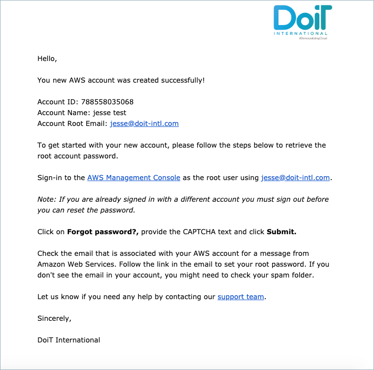

.. _amazon-web-services_create-an-aws-account:

Create An AWS Account
=====================

.. epigraph::

   Create new AWS account/s with preconfigured consolidated billing directly from Cloud Management Platform

As a customer, you can create a new AWS account directly from the Cloud Management Platform.

.. IMPORTANT::

   Please note you must be assigned access to the specific Billing Profile under which the domain is managed in order to create a new account.

.. ATTENTION::

   You will see an **OrganizationAccountAccessRole** in the new AWS account. This role is created by AWS and links back to the parent account. When creating the account we will use this role to `create the CloudHealth IAM Role <https://help.doit-intl.com/amazon-web-services/set-up-cloudhealth>`__. The CMP or DoiT International will not use this role afterwards and you will have to **manually remove this role from your account**

Start with you logging into the `Cloud Management Platform <https://app.doit-intl.com>`__, and Access the 'Create AWS Account' from the menu on the left-hand side of the page and clicking on Assets.

.. image:: ../_assets/assets-icon-1-\ (4)\ (5)\ (5)\ (4).png
   :alt: A screenshot showing the location of the _Create AWS Account_ menu item

On the right-hand side of the page, click the bottom facing arrow and choosing 'Create Account'.

.. image:: ../_assets/aws-create-account-doit\ (1).png
   :alt: A screenshot showing the location of the _Create Account_ option

Choose the Billing Profile to which you're creating the account for while choosing the name of the account to which the *root email* is associated with.

.. image:: ../_assets/image\ (140).png
   :alt: A screenshot of the _Create New Account_ form

Click 'Create' and a popup will appear that the account was created successfully.

.. image:: ../_assets/aws-account-successful2.png
   :alt: "Account created successfully! Check your email for further instructions"

As listed in the popup, an email is sent out for further instructions, here is an example.

The following video shows you how to create an AWS Account.

.. raw:: html

   
<iframe src="https://www.loom.com/embed/f92b0a76aa884a52ad9281f0736f44a1" style="top: 0; left: 0; width: 100%; height: 100%; position: absolute; border: 0;" allowfullscreen scrolling="no" allow="encrypted-media;"></iframe>

If you require further assistance please contact our support team at `support.doit-intl.com <https://support.doit-intl.com>`__
