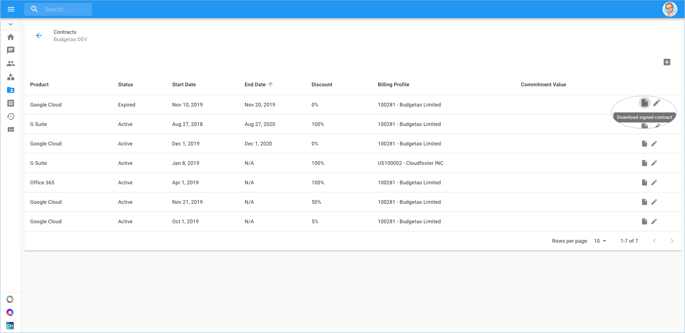

.. _assets-and-contracts_accessing-your-contracts-with-doit:

Access Contracts
================

As a customer, you can access your company Contracts, including their full details and the actual contract documents. In order to access the Contracts section, go to the menu on the top left-hand side of the page and click on Contracts.

.. IMPORTANT::

   Required Permission: Contracts Viewer

.. image:: ../_assets/contracts.png
   :alt: A screenshot showing the location of the _Contracts_ menu item

You're now able to observe the details of the contract such as start and end dates, and in addition, access the original executed contract document.

