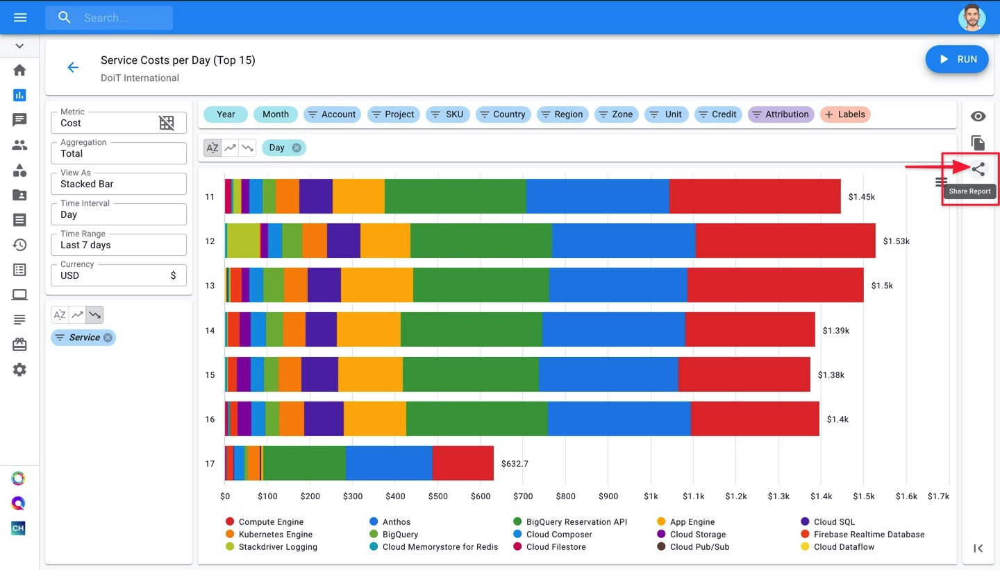
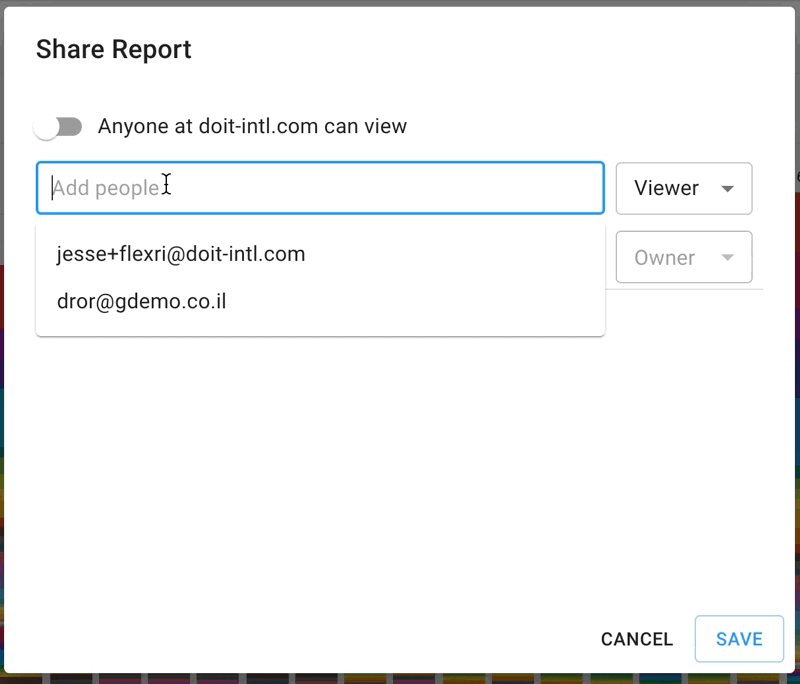
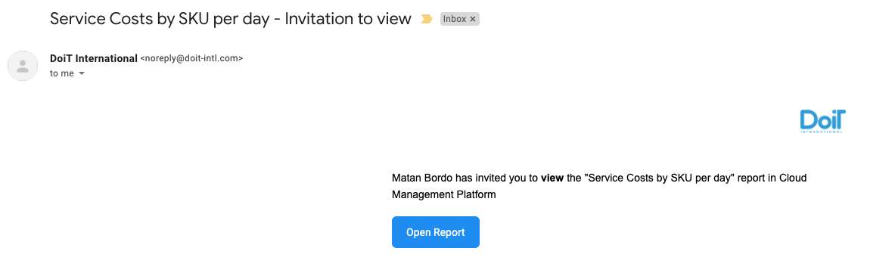
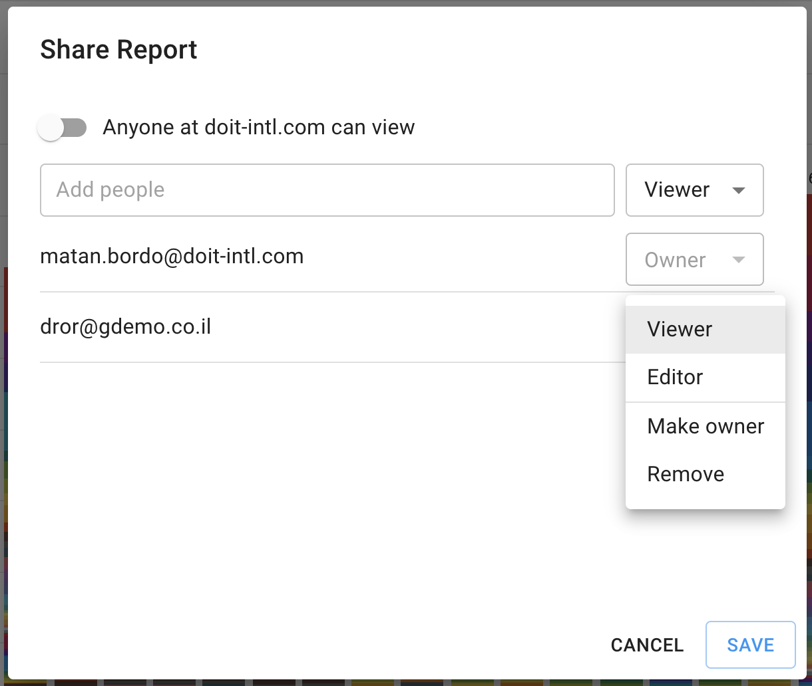

.. _cloud-analytics_sharing-cloud-reports:

Share and Download Cloud Analytics Reports
==========================================

.. epigraph::

   Share and collaborate on Cloud Analytics Reports with your peers and team members.

1) Sharing Cloud Analytics Reports
----------------------------------

.. NOTE::

   If you're new to Cloud Reports and/or haven't created a Cloud Report yet, we recommend reading our post on :doc:`Creating Cloud Reports <create-cloud-report/index>` *before reading further.**

Before discussing how to share a Cloud Report, let's briefly review roles and permissions.

Available Sharing Permissions
^^^^^^^^^^^^^^^^^^^^^^^^^^^^^

* **Viewer**: Sees the report in "read-only" mode. Can only modify "Metric" and the chart type.
* **Editor**: Can modify all settings of a Cloud Report, and share the report with others.

How to share a report
^^^^^^^^^^^^^^^^^^^^^

To share a Cloud Report with your team, click the "Share" button on your report's page.

This will open a pop-up that will give you two options when sharing:

* Give everyone on your team Viewer access.
* Explicitly give someone from your team Viewer or Editor Access.

Once you've entered the email(s) of who you're sharing your Cloud Report with, click "Add" and then hit "Save" to apply your changes.

Once a report is shared, the recipient(s) will receive an email that looks like this:

Editing a user's role
^^^^^^^^^^^^^^^^^^^^^

To change a user's role, make them the owner of the report, or remove them from the report, click on the dropdown next to their email in the Share Report pop-up. From there, make a selection and click "Save" to apply the changes.

1) Downloading Cloud Analytics Reports
--------------------------------------

In Cost Analytics &gt; Reports, once you have saved your report you can download it, following these steps:

3) Click on this icon on the side
---------------------------------

.. image:: ../_assets/image\ (87).png
   :alt: A screenshot showing the _Download_ icon

1) Choose between "Export to CSV" and "Export to Google Sheets"
---------------------------------------------------------------

.. image:: ../_assets/cloud-analytics-report-export.gif
   :alt: An animated screenshot showing the export options menu
