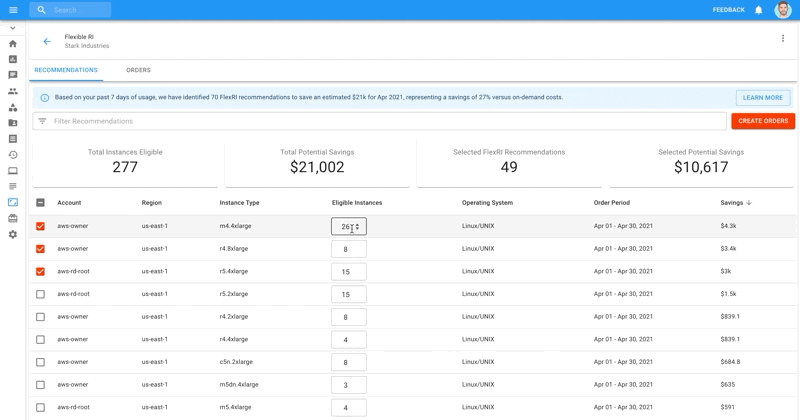

.. _flexible-reservations_flex-ri-recommendations:

Flex RI Recommendations
=======================

.. epigraph::

   Identify eligible on-demand EC2 instances to save costs on.

:doc:`Flexible Reserved Instances <flex-ri>` (Flex RIs) let you commit to EC2 Reserved Instances in one-month intervals while sharing in >=80% of the AWS-listed discount for the equivalent 1-year RI commitment.

**Flex RI Recommendations** identifies your AWS EC2 instances that aren't covered by a billing discount mechanism (RIs, Savings Plans, etc.), and calculates the ideal number of Flex RIs recommended to optimize your spend. You can then purchase these Flex RIs from DoiT in just a few clicks.

.. IMPORTANT::

   Required Permissions: **Flexible RI Admin**

View Flex RI Recommendations
----------------------------

To view your Flex RI Recommendations, click on the "Flexible RIs" icon in your left-hand navigation panel. By default, you'll start on the "Recommendations" tab.

Towards the top, you'll see a summary of the recommendations displayed in a blue information box summarizing:

* the total number of recommendations, and
* anticipated savings expressed in absolute dollars and percentage relative to current spend

.. ATTENTION::

   All recommendations are for the following month, and based on your EC2 usage data over the previous seven days.

.. image:: ../_assets/image\ (22).png
   :alt: A screenshot showing the _Flexible RIs_ menu item, _Recommendations_ tab, and information box

Right below this summary you'll find a few important metrics around your Flex RI Recommendations. These metrics will update dynamically based upon your selections from the table below.

Understanding Flex RI Recommendation Metrics
--------------------------------------------

.. image:: ../_assets/image\ (21).png
   :alt: A screenshot of the _Flex RI_ recommendations metrics

**Total Instances Eligible:** total number of EC2 instances (across all recommendations) that don't appear to be covered by a discounted billing mechanism such as RIs, Savings Plans, etc.

**Total Potential Savings:** your potential cost savings resulting from purchasing Flex RIs for *all* eligible instances listed in the table below.

**Selected Flex RI Recommendations:** number of eligible instances you've selected for inclusion in the Flex RIs order.

**Selected Potential Savings:** your potential cost savings resulting from purchasing Flex RIs for the instances you've *selected*.

Implementing Recommendations
----------------------------

By default, your recommendations are sorted by potential savings in descending order. However, you can sort or filter through your recommendations by any of the displayed columns.

First, select which recommendations you'd like to implement by clicking the checkbox next to each recommendation. To choose all recommendations, click on the checkbox that appears to the left of the "Account" column.

Note that as you select recommendations, the values appearing under the "**Selected Flex RI Recommendations**" and "**Selected Potential Savings**" widgets will adjust accordingly, as shown below.

.. image:: ../_assets/flexrecs.gif
   :alt: An animated screenshot showing how selecting recommendations updates the widget values

Modifying eligible instances for a recommendation
^^^^^^^^^^^^^^^^^^^^^^^^^^^^^^^^^^^^^^^^^^^^^^^^^

For every recommendation, you may also modify the number of eligible instances you'd like covered by Flex RIs. The default number displayed is the number of machines you're currently running for that given instance type and region.

If you anticipate that demand will increase/decrease, you can edit the number under the "Eligible Instances" column.

Again, the numbers displayed in the widgets will adjust accordingly.

Finally, if you change your mind and want to revert back to the original recommendations, click the "Reset" button in the blue information box.

.. image:: ../_assets/image\ (19).png
   :alt: A screenshot showing the location of the _Reset_ button

Create your order
^^^^^^^^^^^^^^^^^

After selecting a set of recommendations to implement, click on the red "Create Orders" button towards the top-right of your screen.

This will open an Order Confirmation pop-up which lets you know:

* How much you will pay if you fully utilize your flexible reserved instances,
* How much you *would* pay if you continued using on-demand instances, and
* Your anticipated savings, expressed in percentages, given your selected recommendations

After reviewing, click "Confirm" to place your order. You will still be able to edit your orders up until the last 24 hours of the current month.

.. image:: ../_assets/image\ (18).png
   :alt: A screenshot showing the _Order Confirmation_ dialog

Modifying Orders
----------------

To view, edit, or cancel your Flex RI orders, switch to the Orders tab.

As with purchasing Flex RIs, you can modify your orders up until the final 24 hours of the current month.

You can easily identify your orders by filtering for orders that have Status ==  New, and have your Email associated with it. By default, all purchases made via the Recommendations tab will have "Based on FlexRI Recommendation" under Order Notes as well.

Then click on the "Edit Order" icon next to the order you wish to modify.

.. image:: ../_assets/image\ (27).png
   :alt: A screenshot showing the location of the _Edit Order_ icon for new orders

Here you can modify any aspect of your order, including number of instances.

You can also make the order a recurring purchase up to a certain month and year, or modify the Order Notes to give the Flex RI purchase more context.

.. image:: ../_assets/image\ (26).png
   :alt: A screenshot showing the _Flexible Reserved Instances Order_ modal dialog
