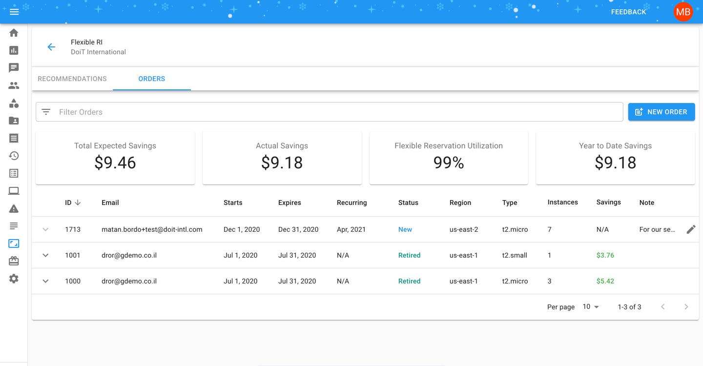
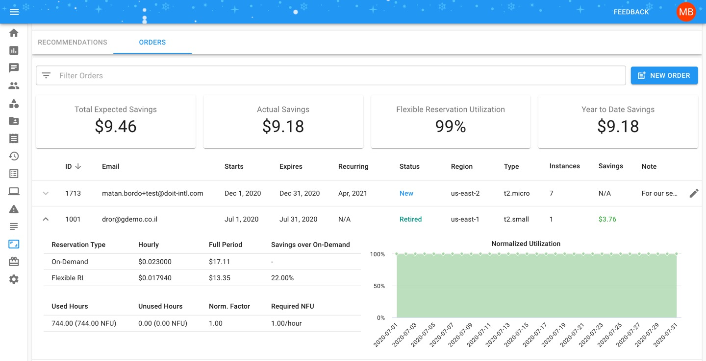

.. _flexible-reservations_flex-ri:

Flexible Reservations Overview
==============================

.. epigraph::

   How to purchase AWS EC2 Flexible Reservations and monitor their utilization

Overview
--------

Flexible Reserved Instances let you commit to EC2 Reserved Instances in one-month intervals while still sharing in the AWS-listed RI commitment discount. With Flex RIs, you'll eliminate RI lock-in risk for your less predictable workloads.

In order to use Flexible Reservations, your AWS account/s should be consolidated with DoiT International billing organization. DoiT International is a global `AWS Advanced Channel Reseller <https://partners.amazonaws.com/partners/001E000001HPlIAIA1/>`__.

.. IMPORTANT::

   Required Permissions: **Flexible RI Admin**

How to purchase Flex RIs
------------------------

To begin, click the 'Flexible RIs' icon on the left-hand side of the page. Once you're at the Flexible Reserved Instances page, click on 'New Order', located on the right-hand side of the page.

.. image:: ../_assets/cleanshot-2020-11-26-at-10.42.36.jpg
   :alt: A screenshot showing the location of the _New Order_ menu item

Complete your Flexible Reserved Instances order by providing the following information:

.. list-table::
   :header-rows: 1

   * - Field
     - Description
   * - Account
     - AWS account for this order
   * - Region
     - AWS region for this order
   * - Instance Type
     - note, only instances not associated with existing reservations or saving plans are shown
   * - Operating System
     - **Options include:** Linux/UNIX, Windows, Windows/SQL.Std, Windows BYOL, Windows/SQL.Ent, Windows/SQL.Web
   * - Qty
     - how many instances of the selected "Instance Type" the order should include
   * - Recurring
     - For orders with a recurring basis, select the last month you want this order to go
   * - Notes
     - Use notes to give more context to your order such as PO numbers, workload names, etc.

.. image:: ../_assets/image\ (6).png
   :alt: A screenshot of the _Flexible Reserved Instances Order_ modal dialog

Click "Submit" and your order will be created and become visible in the list:

.. ATTENTION::

   Please note that new orders and editing previous orders can only be submitted up until the last 24 hours of the current month. After that date, orders will become **Pending** while we conduct an internal review before activating your Flexible Reservations.

Monitoring Flex RIs
-------------------

At the top of the Flex RI page, you'll see four Flex RI Reporting metrics that give you a high-level overview of your past and existing Flex RI purchases:

* **Total Expected Savings** - the maximum amount you could have saved, given 100% utilization
* **Actual Savings** - the amount you actually saved
* **Flexible Reservation Utilization** - a weighted FlexRI percentage of orders utilization
* **YTD Savings** - the total saving across all your reservations, from the beginning of the current year.

.. ATTENTION::

   The first three metrics are based on what is shown in the table, meaning taking into account any filters you've set on your orders. The last metric takes *every* Flex RI order into account when calculating the number.

Flex RI Order Statuses
^^^^^^^^^^^^^^^^^^^^^^

Under the "Status" column, Flex RI orders can have four possible values:

* **New**: the order was made, but goes into effect in the following month or beyond (if a recurring purchase is set up). New orders can be modified until the third-to-last business day of the month prior to when they go into effect.
* **Active**: the Flex RI order is currently being applied to the instance(s) specified
* **Retired**: the order is past its expiration date
* **Canceled**: the order was cancelled and never applied

To view usage statistics on a specific order, click on the arrow next to an active or retired order to expand your order and view more details.

You can see the difference between the on-demand price per hour vs. the Flex RI, and further inspect the utilization graph for additional details on your flexible reservation.

Flex RI Invoices
----------------

For each order of Flexible Reservations, you'll see one or both of the following lines on your monthly invoice:

* Flexible RI #ID Savings
* Flexible RI #ID Underutilization

The "Flexible RI Savings" will state the amount you have saved due to the purchase of Flexible Reservation/s for a given month.

The optional "Flexible RI Underutilization" will state the amount deducted from the cost of the reservation if the underlying instance wasn't utilized 100% of the time during the month.

View the bite-sized video below for a closer look at purchasing and viewing your Flex RIs.

.. raw:: html

   
<iframe src="https://www.youtube.com/embed/Si6mZvn-z7I?rel=0" style="top: 0; left: 0; width: 100%; height: 100%; position: absolute; border: 0;" allowfullscreen scrolling="no" allow="accelerometer; clipboard-write; encrypted-media; gyroscope; picture-in-picture;"></iframe>

