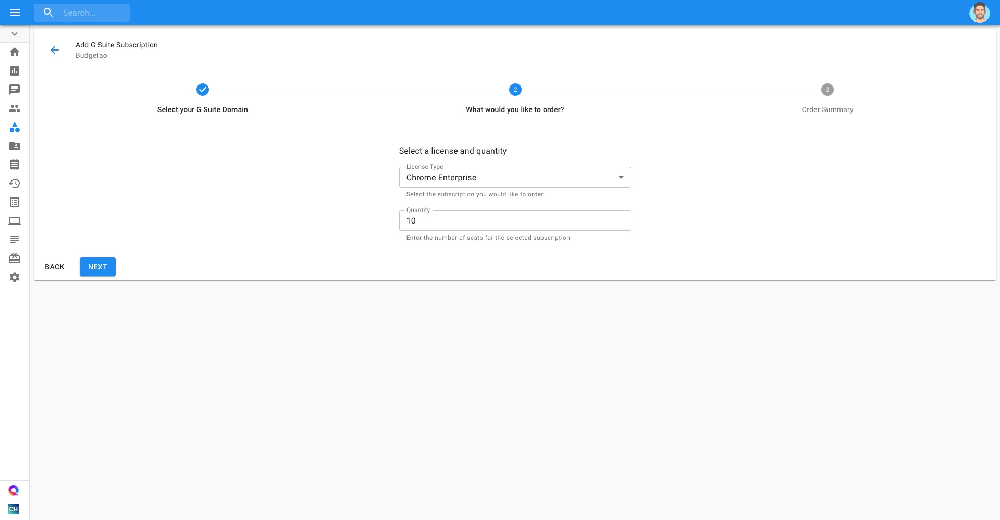

.. _g-suite-and-workspace_add-a-new-g-suite-subscription:

Add a New G Suite Subscription
==============================

.. epigraph::

   Add new subscriptions to your existing G Suite or Google Workspace account with DoiT International

If you would like to purchase a new G Suite subscription, you can do so through the Cloud Management Platform.

.. IMPORTANT::

   Required Permission: **Assets Manager**

.. ATTENTION::

   *Please note that you must be assigned access to the specific Billing Profile under which the domain is managed in order to purchase a new subscription.*

From the main dashboard please select '**Manage Licenses & Assets**'.

.. image:: ../_assets/new-manage-licenses-2-\ (1)\ (7).png
   :alt: "Manage Licenses & Assets"

Another way to access the G Suite based Assets is via the menu on the left-hand side of the page and clicking on Assets.

.. image:: ../_assets/assets-icon-1-\ (4)\ (5)\ (5)\ (5).png
   :alt: A screenshot showing the location of the _G Suite_ menu icon

Once you're at the Assets page, switch to the G Suite tab and click on '**New Subscription**'.

.. image:: ../_assets/g-suite\ (2)\ (2)\ (2)\ (1)\ (2).png
   :alt: A screenshot showing the location of the _G Suite_ tab

Select the domain for which you're adding a subscription and click 'Next'.

.. image:: ../_assets/g-suite1.jpg
   :alt: A screenshot showing the domain selection drop-down menu

Select the Subscription/License and quantity you'd like to order.

Lastly, review your order summary and, if you approve, click 'Submit'

.. image:: ../_assets/g-suite3.jpg
   :alt: A screenshot showing the review screen and _Submit_ button
