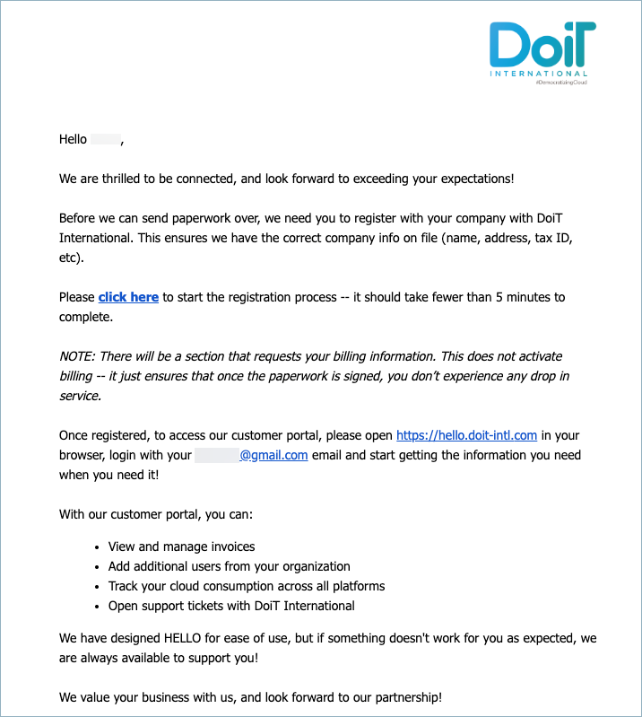
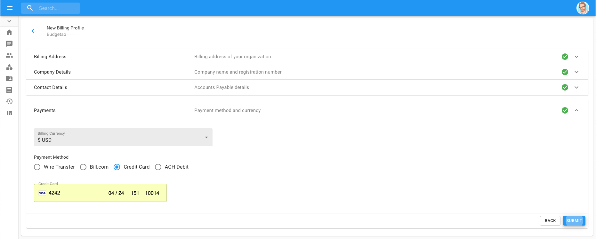

.. _general_registration:

Company Registration
====================

.. epigraph::

   Your first step to start using DoiT International Cloud Management Platform

At DoiT International we want to create a seamless customer experience from the very first touch-point to the post-contract stage, and that's why registering your company through our Cloud Management Platform is an integral part of a successful customer onboarding process.

At some point in your communications with DoiT International's Account Management team, you will receive an e-mail to register your company and complete the form (see example below)

Click the link in the email to start the sign-in & registration process. You will be brought to the 'New Billing Profile' section of the customer onboarding process where you will fill out your company's information.

.. image:: ../_assets/create-new-billing-profile-2-\ (1)\ (2).png
   :alt: A screenshot of the _New Billing Profile_ form

In conclusion, enter your payment method and currency and click 'Submit'.

.. IMPORTANT::

   Please note that there will be a section that requests your billing information. This does not activate billing, it just ensures that once the paperwork is signed, you don"t experience any drop in service.

The following video shows you how to Register your Company.

.. raw:: html

   
<iframe src="https://www.loom.com/embed/cdc521cedb0e443c9d1f464fd8d53d8c" style="top: 0; left: 0; width: 100%; height: 100%; position: absolute; border: 0;" allowfullscreen scrolling="no" allow="encrypted-media;"></iframe>

