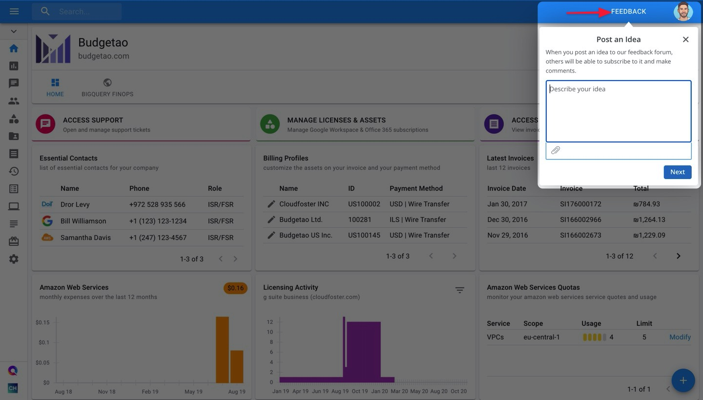
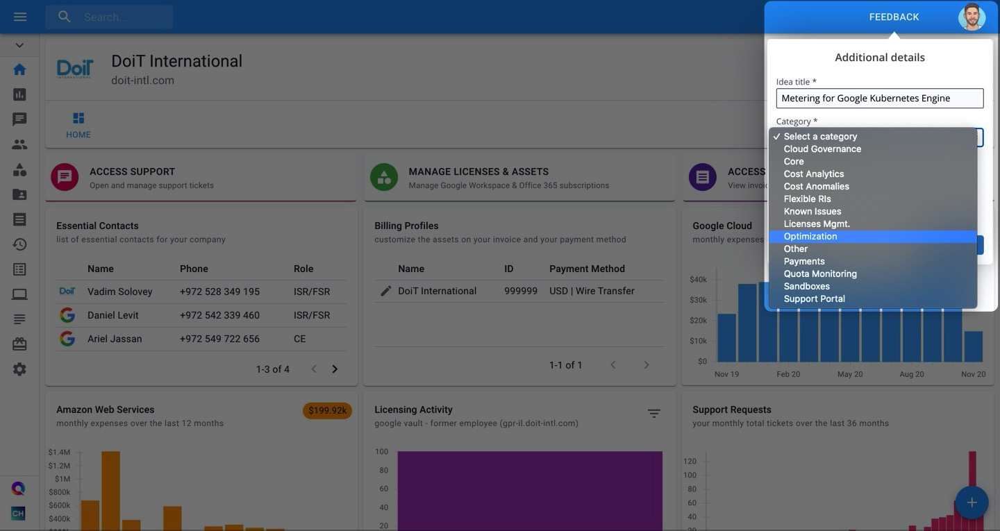
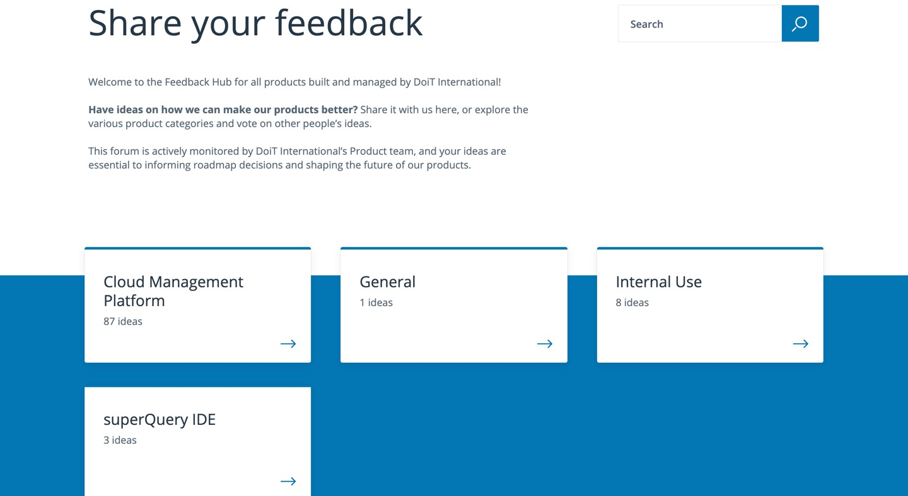
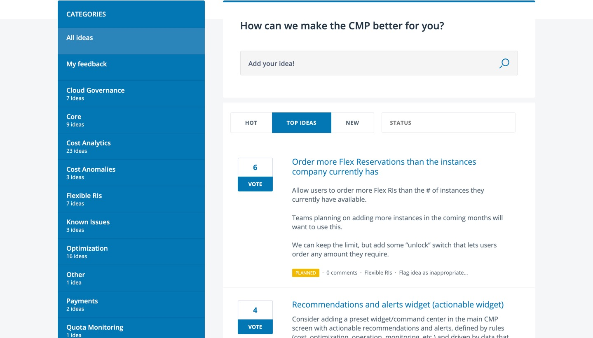

.. _general_sharing-feedback-and-feature-requests:

Sharing Feedback
================

.. epigraph::

   How to send your feedback and suggestions with the product team directly from the CMP

When it comes to building a better Cloud Management Platform for you and all customers, your feedback plays a key role. **It is one of the important pieces of input we consider when planning our roadmap, and gives us clear indications of where the needs are in the market**.

Now you can share product feedback and feature requests with us directly from the CMP. Read on to see how. Check out our `Feedback Hub <https://feedback.doit-intl.com/>`__ to view the ideas that have already been shared and upvote them.

How to share ideas within the CMP
---------------------------------

To share your feedback with us, click on the **FEEDBACK** button at the top-right of your screen. Then describe your feature request or general feedback, providing screenshots or images to give more context as needed.

Once finished, click **Next**. If there are similar requests or suggestions to the one you wrote, we will display them for you to upvote in our Feedback Hub instead of submitting a new request.

If your request doesn't already exist, click "**Skip and post idea**".

.. image:: ../_assets/feedback2a.jpg
   :alt: A screenshot showing a list of suggestions and the location of the _Skip and post idea_ button

Finally, give your idea a title and select the best category it fits under, as shown in the example below. Once you click Submit, it will appear in our Feedback Hub for others to upvote and the product team will be notified.

Upvoting Existing Ideas in the Feedback Hub
-------------------------------------------

When you :doc:`share feedback and/or feature requests <sharing-feedback-and-feature-requests>` with us, they get submitted to our `Feedback Hub <https://feedback.doit-intl.com>`_. There, you see and upvote any ideas you like.

Let's go over how to navigate the Feedback Hub and upvote ideas.

From the home page, select a category whose ideas you'd like to take a look at. Alternatively, you can search for them directly in the search box.

After clicking on a category, you can search for ideas by their sub-categories on the left-hand side. Additionally, you can sort through them via categories such as "Hot", "Top Ideas", "New", or "Status".

If an idea has been added to the roadmap or development has begun, you will see a colored status icon similar to the yellow "Planned" rectangle in the screenshot below.

Upvote an idea that interests you by clicking on the "Vote" button next to the idea. Finally — if you aren't signed in already — enter your email or sign in with Google to submit your vote.

You will be notified if the status of the idea changes or ultimately gets released in the product it corresponds to.

.. image:: ../_assets/feedbackhub4.jpg
   :alt: A screenshot showing the voting modal dialog
