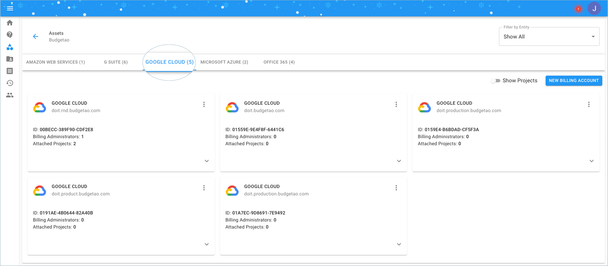
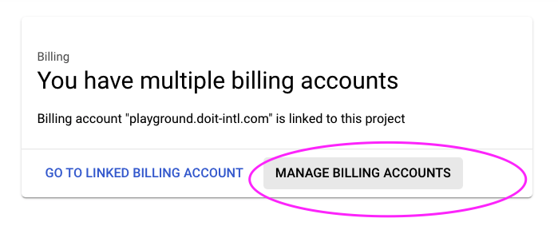
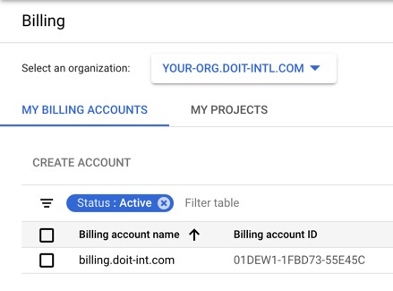
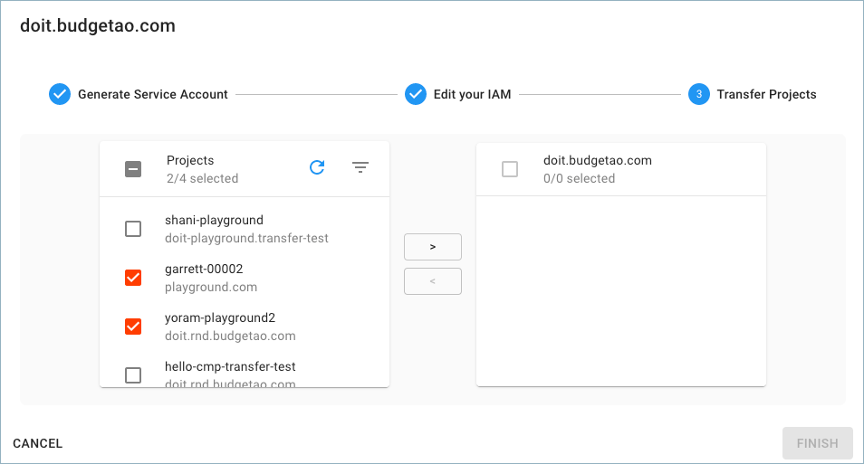
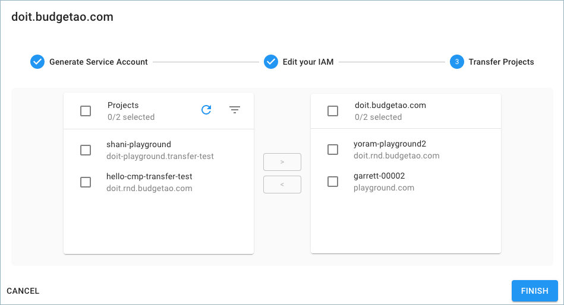

.. _google-cloud_gcp-transfer_bulk-transfer-using-wizard:

Bulk Transfer using Wizard
==========================

This guide will instruct you how to switch billing for large amount of GCP projects *en masse.*

.. WARNING::

   Please mind the Google Marketplace :doc:`note <../index>`.

Get Service Account from CMP
----------------------------

Start with you logging into the `Cloud Management Platform <https://app.doit-intl.com>`__, and select '**Manage Licenses & Assets**' from the main dashboard:

.. image:: ../../_assets/transfer-projects.png
   :alt: A screenshot showing the location of the Manage Licenses & Assets option

Once you're at the **Assets** page, please switch to the Google Cloud tab

To transfer your projects, locate your new Google Cloud billing account with DoiT International (doit.budgetao.com in this example), and click on the three-dots menu on the right-hand side of the widget. Choose 'Transfer Projects' to start the wizard.

.. image:: ../../_assets/transfer-projects1\ (1)\ (1)\ (1).png
   :alt: A screenshot showing the location of the Transfer Projects option

Acknowledge the Marketplace Apps consent and click "Start":

.. image:: ../../_assets/transfer-gcp.png
   :alt: A screenshot showing the start of the Transfer Projects flow

After you begin the transfer process, a dedicated Google Cloud service account will be generated to facilitate the transfer process.

Finally, **copy the service account name**. You will need it for the next step.

.. image:: ../../_assets/transfer-projects3.png
   :alt: A screenshot showing the Edit your IAM section of the Transfer Projects flow

Grant permissions to the service account
----------------------------------------

To ensure transfer wizard sees all of your projects let's grant "Billing Account Administrator" role for the service account **both** on your current billing account and your GCP Organization.

You can either run gcloud CLI commands as listed in the wizard:

.. image:: ../../_assets/image\ (58)\ (1).png
   :alt: A screenshot showing the location of the expand icon for viewing the CLI commands

Or follow the detailed instructions below grant the access using GCP Console UI.

Grant permissions for GCP Organization
^^^^^^^^^^^^^^^^^^^^^^^^^^^^^^^^^^^^^^

* Go to GCP `Resource Manager <https://console.cloud.google.com/cloud-resource-manager>`__
* Select your organization
* On the permissions info panel on the right, add the service account email as Billing Administrator Administrator

.. image:: ../../_assets/image\ (55).png
   :alt: A screenshot showing you how to access the Add Member button

.. image:: ../../_assets/image\ (57)\ (1).png
   :alt: A screenshot showing you the Add members form

Grant permissions for Billing Account
^^^^^^^^^^^^^^^^^^^^^^^^^^^^^^^^^^^^^

Per the instructions from the image above, we'll need to add the service account to your Google Cloud Organization IAM Policy with the "Billing Administrator" role.

First, navigate to your Google Cloud Console and click on "**Billing**"

.. image:: ../../_assets/screen-shot-2021-02-12-at-11.28.16-am.png
   :alt: A screenshot showing you the location of the Billing navigation menu item

Next, click on "**Manage Billing Accounts**"

Make sure your organization is selected. Then select the billing account you want to edit.

In the Billing Overview screen, select "Manage" on the right.

.. image:: ../../_assets/screen-shot-2021-02-12-at-11.29.23-am.png
   :alt: A screenshot showing you the location of the Manage option

Then, click the "**Show Info**" panel at the top-right to manage billing account members. From there, click "**Add Member**".

.. image:: ../../_assets/add-member-project-transfer.jpg
   :alt: A screenshot showing you how to access to the Add Member button

Finally, paste the service account you copied earlier from the CMP Project Transfer tool and add the "Billing Account Administrator" role as shown below. Then click "Save".

.. image:: ../../_assets/image\ (56).png
   :alt: A screenshot showing you the Add members form

If you do not add the service account to your Google Cloud Organization IAM, the following error will appear.

.. ATTENTION::

   If you incorrectly add the service account to one of your Google Project IAM and not the Organization IAM, the following error will appear: **Service Account Not Found in Organization IAM**.

Transfer your Projects
----------------------

Select the projects you want to transfer to your new Google Cloud Billing Account with DoiT International.

By clicking the **>** button, the selected projects are designated to be transferred. Review the list of projects you intend to transfer, validate it and click 'Finish'.

The confirmation page informs you of how many projects were transferred, and by selecting the 'Click here' button you can retrieve the full list of transferred projects as they will be copied to your clipboard.

.. image:: ../../_assets/transfer-projects8.png
   :alt: A screenshot showing you the final confirmation screen

Congrats! You have successfully reassigned your existing Google Cloud projects to your new billing account with DoiT International! Well done!

Partial Transfers
-----------------

If some or all of your projects don't transfer successfully, you will see a discrepancy when you complete your transfer process between the number of projects successfully transferred and the total number of projects you attempted to transfer.

If *some* of your projects transferred, this is the message you will see.

.. image:: ../../_assets/screen-shot-2020-09-10-at-16.14.00-1-\ (1)\ (1).png
   :alt: A screenshot showing you final screen when only some projects were transferred

If none of your projects were successfully transferred, you will see this message.

.. image:: ../../_assets/screen-shot-2020-09-10-at-16.10.34-1-.png
   :alt: A screenshot showing you the final screen when none of your projects were transferred

**Troubleshooting**
-----------------------

All / Some Projects Don't Transfer Successfully
^^^^^^^^^^^^^^^^^^^^^^^^^^^^^^^^^^^^^^^^^^^^^^^

There are a few "edge case" situations in which some or all of your Google Cloud projects won't transfer successfully:

#. The project(s) is associated with another Google Organization that the service account doesn"t have an access to.
#. The origin billing account is not under the Organization the service account has permissions to.

To identify which project(s) didn't transfer successfully, click on the hyperlinked "Click here" in the pop-up shown above. This will copy to clipboard all of the projects you attempted to transfer, as well as their statuses.

Here is an example output:

.. code-block:: text

   project-id-1, success
   project-id-2, success
   project-id-3, error-code

From here you can troubleshoot the project(s) that have "error-code" for one of the two "edge case" situations we described above.

Accidentally Added Service Account at the Project Level
^^^^^^^^^^^^^^^^^^^^^^^^^^^^^^^^^^^^^^^^^^^^^^^^^^^^^^^

As mentioned above, you will get an error if you add your service account to at the Project level and not the Organization level. The error will look something like: **"Service Account Not Found in Organization IAM"**.

To fix the situation please grant the service account Billing Account Admin role at the Organization level as described above and try again.

Video
-----

The following video shows you how to Transfer Google Cloud Projects.

.. raw:: html

   
<iframe src="https://www.loom.com/embed/35299f0634e849a2821155c7488faedd" style="top: 0; left: 0; width: 100%; height: 100%; position: absolute; border: 0;" allowfullscreen scrolling="no" allow="encrypted-media;"></iframe>

