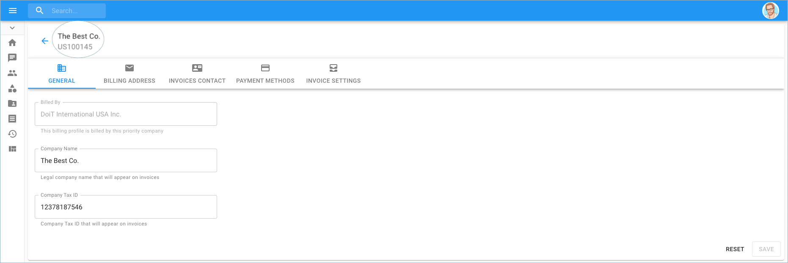

.. _invoices-and-payments_changing-your-company-name:

Change Company Name
===================

.. epigraph::

   How to modify your company's name in the Cloud Management Platform

A customer can edit the name of their company if they choose to do so.

.. IMPORTANT::

   Required Permissions: **Billing Profile Admin**

.. ATTENTION::

   Please note that you must be assigned access to the specific Billing Profile under which the domain is managed in order to purchase a license.

From the main dashboard, click on the edit icon next to the Billing Profile of which you want to update.

.. image:: ../_assets/update-billing-profile-2-\ (4)\ (4)\ (1)\ (2).png
   :alt: A screenshot showing the location of the _Edit_ icon

The next page brings you to the 'General' tab where you can change the name of your company.

.. image:: ../_assets/change-company-name2.png
   :alt: A screenshot showing you location of your editable company name

Once you have made the necessary changes, click on 'Save' at the bottom right-hand side of the page. Notice the change of the company name at the top of the page.

