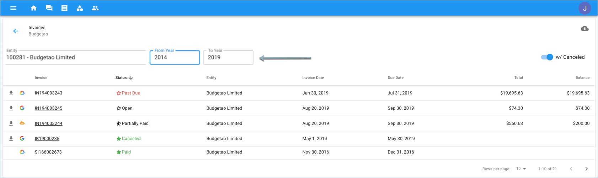

.. _invoices-and-payments_managing-invoices:

Managing Invoices
=================

.. epigraph::

   Manage all of your Google Cloud, Amazon Web Services, G Suite or Office 365 invoices in all place

As a customer, you can access your company invoices, including their full details and the actual invoice documents.

.. IMPORTANT::

   Required Permissions: **Invoice Viewer**

Start with accessing ``Invoices`` from the menu on the top left-hand side of the page and clicking on Invoices, or locating the icon as seen in the example below.

.. image:: ../_assets/invoice-icon.png
   :alt: A screenshot showing you the location of the _Invoices_ menu item

You can filter the invoices per billing profile to which it was issued, and by issue date of the invoice. To filter the invoices, use the dropdown controls at the top of the page.

In addition, there is the option to download the invoice summary as a CSV file by clicking the download icon in the top-right corner of the page.

.. image:: ../_assets/download-csm-summary\ (1).png
   :alt: A screenshot showing you the location of the download icon

There are five possible statuses for invoices:

#. **Open** - shows the amount owed and due date of the payment.
#. **Canceled** - canceled removes the charge but remains listed in your Sales Invoices history for review if necessary.
#. **Paid** - the amount was delivered and approved.
#. **Partially Paid** - the total amount was not fully delivered and has yet to have been approved.
#. **Past Due** - invoice due date of payment has passed.

By clicking on an invoice number (e.g., **IN1940032243**) you can review additional details of the invoices such as detailed invoice lines. There is also the option to view the document as a PDF file.

If you would like to pay for an invoice now, go to the '**Pay Now**' button on the top right-hand part of your page.

.. image:: ../_assets/pay-now.png
   :alt: A screenshot showing you the location of the _Pay Now_ button

For further instructions on how to pay for an invoice, please proceed to the ':doc:`Pay Invoice <paying-invoices-with-credit-card-or-ach>`' article.
