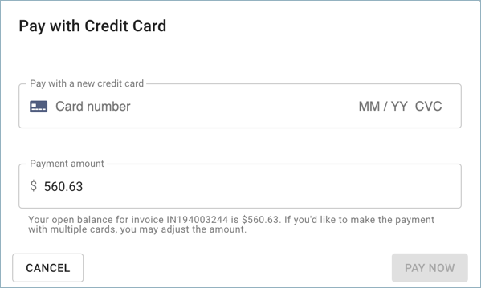
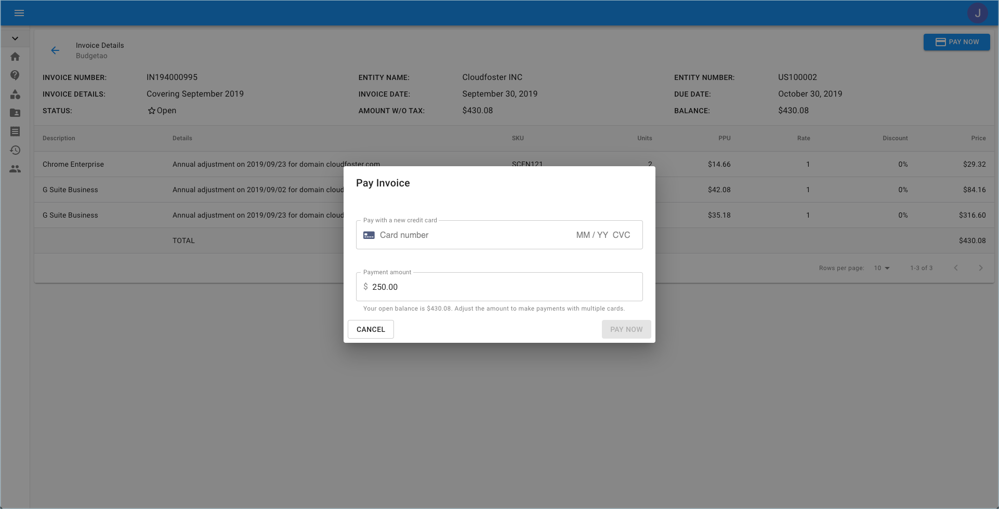

.. _invoices-and-payments_invoices-payments-paying:

Pay with a Credit Card or ACH
=============================

.. epigraph::

   Cloud Management Platform support multiple payment methods across 70+ countries.

You have the option to pay the open (i.e., unpaid) invoices with a credit card. We process the credit cards with an emphasis on the security of the provided information.

.. IMPORTANT::

   Required Permissions: **Invoice Viewer**

.. ATTENTION::

   Please note that you must be assigned access to the specific Billing Profile under which the domain is managed in order to purchase a license.

To pay for an invoice, please select the '**Pay Now**' button, located on the top right-hand corner of the page.

.. image:: ../_assets/pay-now.png
   :alt: A screenshot showing you the location of the _Pay Now_ button

Once clicking on 'Pay Now', a popup to enter your credit card details will appear. If you haven't entered the credit card details in the past, you'll need to do that here.

Furthermore, you may partially pay for an invoice by manually editing the amount. See the below example for reference.

For customers that have already paid with a credit card in the past, the window will appear with the history of your cards that were previously used. If you see more than one credit card, please select one from the list with which you'd like to pay this invoice.

.. image:: ../_assets/2-cards.png
   :alt: A screenshot of the _Pay with Credit Card_ modal dialog showing previous credit cards on file

After clicking on 'Pay Now' your order transaction will begin to be processed, and once approved by the credit card processor, you will receive the following notification on the bottom left-hand corner of your page. If the payment was successful, the status of the invoice will be switched to '**Paid**'.

.. image:: ../_assets/paid-1-.png
   :alt: A screenshot showing the _Paid_ status

If you choose to use a different payment method, you can use Wire Transfer. The bank details can be found within the PDF of the invoice.
