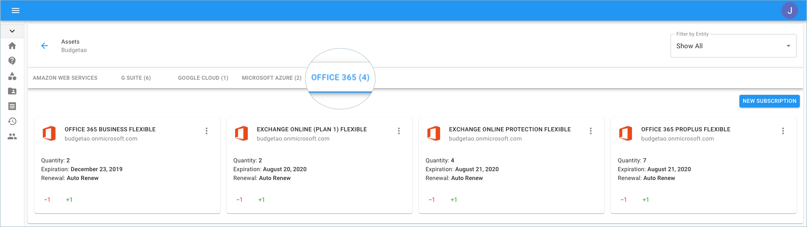
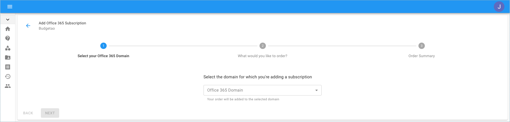
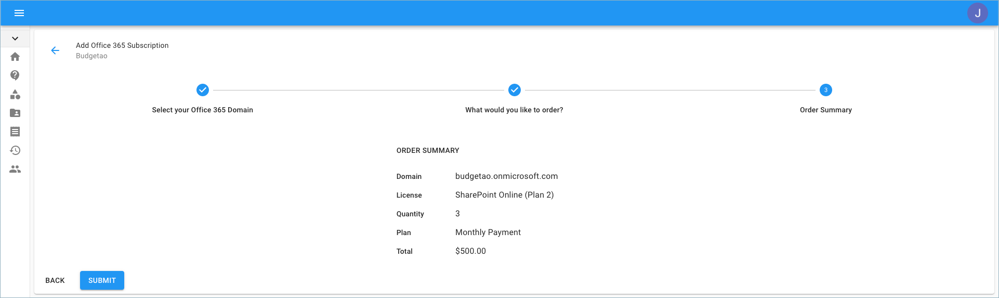

.. _microsoft-office-365_add-new-office-365-subscriptions:

Create Office 365 Subscriptions
===============================

.. epigraph::

   Create new Microsoft Office 365 subscriptions in a few clicks with Cloud Management Platform

You can add a new Microsoft Office 365 subscription to your existing tenant, using the Cloud Management Platform.

.. IMPORTANT::

   Required Permission: **Assets Manager**

.. ATTENTION::

   Please note that you must be assigned access to the specific Billing Profile under which the domain is managed in order to purchase a new subscription.

Start with accessing Office 365 based Assets from the menu on the left-hand side of the page and clicking the 'Assets' icon.

.. image:: ../_assets/assets-icon-1-\ (4)\ (5)\ (5).png
   :alt: A screenshot showing you the location of the _Assets_ menu item

Once you're at the Assets page, switch to the Office 365 tab.

Go to the right-hand side of the page and click on 'New Subscription'.

Select the Subscription/License and quantity you'd like to order.

.. image:: ../_assets/office-365-license-type.png
   :alt: A screenshot showing you a form allowing you to select a license and quantity

Lastly, review your order summary, and if you approve click 'Submit'.

